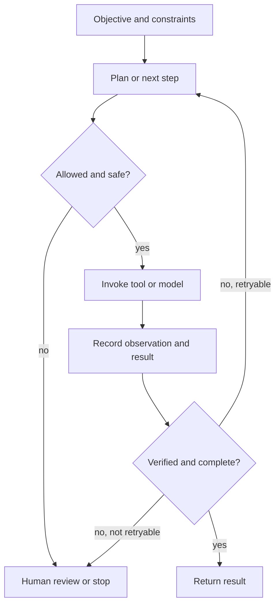

# A bounded action loop

An **agent control loop** is the runtime process that turns an objective and
current context into bounded actions, observes their results, and decides
whether to continue, revise, ask for approval, or stop. A [model inference](model-inference.md) call
can propose a plan, select a tool, or interpret an observation, but the
control loop is the larger system that connects those calls to an environment.

The loop's state includes the objective, constraints, prior observations,
pending plan, available interfaces, approvals, and termination conditions. A
tool invocation is an activity with an input, a requested operation, an
execution context, and an output or error. The output is an observation to be
checked, not automatically a fact or permission for the next action.

# Controls at each transition

1. **Plan.** Select a next step that is relevant to the objective and expose
   enough intent to review its scope and expected result. A plan is a proposal,
   not an authorization grant.
2. **Authorize.** Check the acting identity, target, operation, context,
   policy, and permission before invoking a tool. Use [actions, policies, and permissions](../foundations/actions-policies-and-permissions.md) and [digital identity and authorization](../cybersecurity/digital-identity-and-authorization.md)
   to keep a model-generated argument from becoming an uncontrolled side
   effect. High-impact or irreversible actions may require explicit [human approval](../assurance/requirements-risk-and-review.md) before execution.
3. **Act and observe.** Invoke the selected interface within a timeout and
   record the request, result, error, relevant environment, and responsible
   agent. [Information provenance and trust](../information-systems/information-provenance-and-trust.md)
   explains how these records connect activities, entities, and agents.
4. **Verify.** Compare the observation with an explicit success condition,
   invariants, or independent evidence. A returned value can be syntactically
   valid while being stale, incomplete, unauthorized, or wrong.
5. **Recover or stop.** Retry only when the failure is understood to be
   transient or otherwise safe to repeat; use bounded attempts, backoff,
   idempotency or compensation, and a clear stop condition. Escalate when the
   result is ambiguous, the risk changes, or the loop cannot establish its
   completion claim.

These controls make the loop auditable. [Observability and operational readiness](../software-engineering/observability-and-operational-readiness.md)
provides the runtime signals for diagnosing it, while an [assurance case](../assurance/assurance-case.md)
can use approval records, tool traces, verification results, and failure
handling as evidence for bounded claims. Observability or provenance alone
does not prove that an action was correct or safe.

# Relation to ReAct and agents

[ReAct](../references/react-2023.md) is a research pattern that interleaves
language-model reasoning with task-specific actions and external observations.[^react-paper]
It motivates the plan–act–observe alternation, but it does not by itself
provide authorization, human approval, reliable verification, retry policy, or
assurance. Those are system controls around the pattern.

An [agent](agents.md) is the broader goal-directed system; this concept
focuses on its repeatable control mechanism. An LLM may be one component, and
tools may include retrieval, computation, APIs, or actuators. The loop should
therefore preserve the distinction between a model's generated proposal, an
authorized activity, an observed result, and a justified final claim.

In a learning system, the [reinforcement-learning feedback loop](reinforcement-learning-feedback-loop.md)
adds a longer-horizon relationship between observed transitions, rewards, and
changes to a policy. Runtime authorization and verification still constrain
which proposed actions may actually be executed.

[^react-paper]: Yao et al., [ReAct: Synergizing Reasoning and Acting in Language Models](https://arxiv.org/abs/2210.03629).
