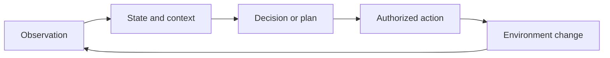

# Goal-directed action

An **agent** is a system that receives observations or requests, maintains or
constructs a view of relevant state, selects actions toward an objective, and
acts through an interface to an environment. In AI, the term usually describes
an engineered system with some capacity to choose among actions; it does not
by itself imply consciousness, moral agency, unrestricted autonomy, or legal
responsibility.

The loop may include planning, tool calls, memory, verification, retries, and
human approval. [ReAct](../references/react-2023.md) is one research pattern
that interleaves language-model reasoning with task-specific actions and
external observations.[^react-paper]
The pattern makes clear that an agent is larger than its model: it also needs
an environment, an action interface, an objective, and controls.

# Boundaries and responsibility

An [LLM](large-language-models.md) can propose text, plans, or tool arguments
inside an agent, but the agent's runtime must validate inputs and outputs,
enforce [actions, policies, and permissions](../foundations/actions-policies-and-permissions.md),
and limit side effects. A proposed action is not an authorized action. Use
[digital identity and authorization](../cybersecurity/digital-identity-and-authorization.md)
to bind actions to a principal and [information provenance and trust](../information-systems/information-provenance-and-trust.md)
to record what the agent observed and changed.

The [entities, activities, and agents](../foundations/entities-activities-and-agents.md)
foundation distinguishes the software system, its activities, and the people
or organizations responsible for deploying or supervising it. For consequential
systems, [moral agency and responsibility](../ethics/moral-agency-and-responsibility.md)
and [assurance cases](../assurance/assurance-case.md) help prevent the system's
capacity to act from being mistaken for a complete responsibility judgment.

[^react-paper]: Yao et al., [ReAct: Synergizing Reasoning and Acting in Language Models](https://arxiv.org/abs/2210.03629).
