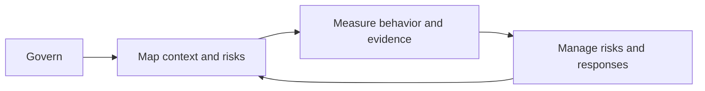

# Evaluation is contextual

An AI system should be evaluated as a system operating in a context, not as a
model considered in isolation. Define the intended task, users, operating
conditions, affected parties, quality properties, failure modes, and possible
consequences before choosing evidence. The system boundary may include data,
interfaces, runtime controls, operators, and the surrounding environment; see
[systems, processes, and boundaries](../foundations/systems-processes-and-boundaries.md).

NIST's AI Risk Management Framework groups risk-management activity into four
functions: Govern, Map, Measure, and Manage.[^nist-ai-rmf-1-0] They are a
repeatable loop rather than a mandatory linear curriculum. Governance sets
roles, policies, and accountability; mapping describes context, impacts, and
risks; measurement gathers and interprets evidence; and management prioritizes
responses, monitoring, and improvement.

# Evidence and decisions

Evaluation evidence can include [model-level generalization and evaluation](generalization-and-model-evaluation.md), including checks for [distribution shift](distribution-shift.md),
results, representative observations,
monitoring records, user feedback, incident reports, and documentation of
assumptions or limitations. Evidence is not self-interpreting: use [claims,
evidence, and inference](../foundations/claims-evidence-and-inference.md) and
[probability and statistical inference](../science/probability-and-statistical-inference.md)
to distinguish an observation, a measure, and a conclusion. Track how inputs,
transformations, and outputs were produced with [information provenance and
trust](../information-systems/information-provenance-and-trust.md).

An [assurance case](../assurance/assurance-case.md) can organize a bounded
claim about an AI system, the argument connecting evidence to that claim,
assumptions, rebuttals, and review limits. Evaluation does not prove that an
AI system is universally safe or correct; it supports a context-bound decision
whose confidence depends on coverage, uncertainty, independence, and the
freshness of the evidence. For runtime behavior and failures, pair this
evaluation with [observability and operational readiness](../software-engineering/observability-and-operational-readiness.md),
which makes system state and operational response evidence inspectable. Responses
may include changing the system,
restricting its use, adding human review, monitoring for drift, or accepting a
documented residual risk through [risk and decision](../foundations/risk-and-decision.md).
For the trustworthiness dimensions, affected groups, and impact-assessment
questions that make this contextual evaluation concrete, see [responsible AI evaluation and impact](responsible-ai-evaluation-and-impact.md).

[^nist-ai-rmf-1-0]: NIST, [Artificial Intelligence Risk Management Framework (AI RMF 1.0)](https://doi.org/10.6028/NIST.AI.100-1).
