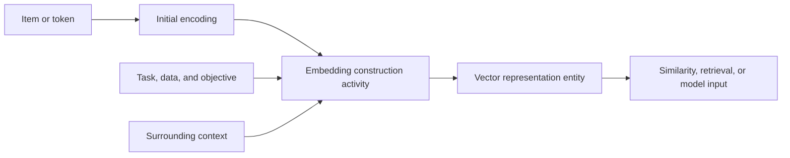

# A vector is a usable representation

A **vector** is an ordered tuple of numbers, such as $\mathbf{x}=(x_1,\ldots,x_d)$.
The number of coordinates $d$ is its dimension. The coordinates are values in a
chosen representation, not automatically named human concepts: the vector
$[2.98,-0.75,0]$ is useful because a model or procedure gives it an
interpretation, not because each coordinate must mean something like
“sweetness” or “grammar.”

An **embedding** is a vector representation produced by mapping an item from a
usually higher-dimensional or symbolic representation into a lower-dimensional
space. The item can be a token, word, sentence, image, user, product, or other
example. The resulting vector is an [entity in a representation](../foundations/information-data-and-records.md): it is data that can be stored and
transformed, while its meaning depends on the model, training data, task, and
context. An embedding is therefore not the item itself and does not guarantee
that it captures every fact about the item.[^google-embeddings-module]

## Embedding spaces and similarity

An **embedding space** is the $d$-dimensional vector space into which examples
are mapped. A construction procedure is designed so that some relationship
useful for the intended task appears as geometric proximity. For vectors
$\mathbf{x}$ and $\mathbf{y}$, a common similarity measure is the dot product
$\mathbf{x}\cdot\mathbf{y}$; cosine similarity instead compares their angle:

$$
\operatorname{cosine}(\mathbf{x},\mathbf{y}) =
\frac{\mathbf{x}\cdot\mathbf{y}}{\lVert\mathbf{x}\rVert\lVert\mathbf{y}\rVert}
$$

The chosen measure and normalization matter. “Close” means similar according
to the data and objective that shaped this space, not necessarily identical in
meaning, causally related, factually true, or appropriate for a new task. A
recommendation embedding and a classification embedding can place the same
items differently because they encode different useful relationships.[^google-embedding-space]

## Static and contextual representations

A **static embedding** assigns one vector to an item wherever it appears. A
static word vector can make words used in similar contexts geometrically close,
but one point cannot represent all senses of an ambiguous word. A **contextual
embedding** is computed with surrounding input, so the same token can receive
different vectors in different sequences. [Tokenization and language sequences](tokenization-and-language-sequences.md) describes the ordered tokens that supply this context, and the [Transformer attention architecture](transformer-attention-architecture.md) describes one way contextual representations are computed from relationships among positions.[^google-obtaining-embeddings]

Contextual does not mean universally meaningful. The representation is still
conditional on the model, the available context, the position and preprocessing
choices, and the learned objective. Two models can produce incompatible vectors
for the same text; their coordinates should not be compared without a shared
space and compatible procedure.

## How representations are constructed

Construction is an [activity](../foundations/entities-activities-and-agents.md)
that produces representation entities. Common patterns include:

1. **Encode:** turn an item into an initial representation, such as a sparse
   one-hot vector or token identifier.
2. **Map or project:** use dimensionality reduction or a learned embedding
   layer to produce a vector with $d$ coordinates.
3. **Shape the space:** adjust parameters during [model training](model-training.md)
   so vectors support the selected objective, such as predicting context,
   classifying examples, or retrieving similar items.
4. **Use the result:** supply vectors to [model inference](model-inference.md),
   compare them, cluster them, retrieve neighbors, or combine them with other
   features.

The procedure may be trained separately or as part of a larger neural network.
The embedding dimension is a design choice or learned setting, and the
individual coordinates are often not independently interpretable.[^google-obtaining-embeddings]

## Representation limits

An embedding is a useful instrument with boundaries:

- **Information loss:** mapping to fewer dimensions or a finite vocabulary can
  discard distinctions; a nearby vector is not a complete record of the source.
- **Task dependence:** geometry reflects the corpus, labels, objective,
  preprocessing, and optimization choices. It can be useful for one purpose and
  misleading for another.
- **Limited interpretability:** dimensions and directions may not correspond to
  stable human concepts, even when distances are operationally useful.
- **Context and coverage:** static vectors collapse senses, while contextual
  vectors depend on the supplied context and may fail on unfamiliar inputs.
- **Inherited and induced bias:** a space can preserve or amplify regularities,
  omissions, and measurement choices in its data and objective.
- **No truth guarantee:** similarity is evidence about a learned relation, not
  proof of a claim. Evaluation must use the intended task, data, uncertainty,
  and [semantics and models](../foundations/semantics-and-models.md) rather than
  treating geometry as meaning itself.

[Information, data, and records](../foundations/information-data-and-records.md)
provides the general distinction between a representation and what it
represents. [Machine learning](machine-learning.md) supplies the broader
training setting, while [model inference](model-inference.md) explains how a
trained representation can participate in producing an output.

[^google-embeddings-module]: Google for Developers, [Machine Learning Crash Course: Embeddings](https://developers.google.com/machine-learning/crash-course/embeddings).
[^google-obtaining-embeddings]: Google for Developers, [Obtaining embeddings](https://developers.google.com/machine-learning/crash-course/embeddings/obtaining-embeddings).
[^google-embedding-space]: Google for Developers, [Embedding space and static embeddings](https://developers.google.com/machine-learning/crash-course/embeddings/embedding-space).
