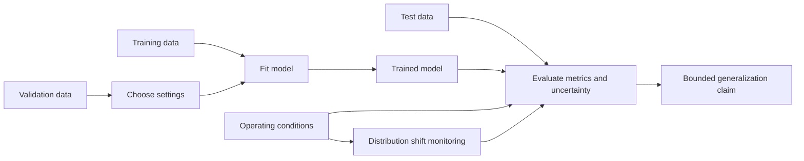

# Performance beyond the training examples

**Generalization** is a model's ability to perform usefully on new inputs drawn
from the intended operating conditions, rather than merely reproducing its
training examples. **Model evaluation** is the activity of collecting and
interpreting evidence about that ability and about relevant failure modes. It
turns a trained model and an evaluation design into measured results, not into
a guarantee that the model is correct.[^google-what-is-ml]

## Data splits and overfitting

The [machine-learning paradigms](learning-paradigms.md) determine what counts
as a target or feedback during training, so evaluation must test the behavior
that the selected paradigm was intended to improve.

A typical evaluation design separates examples into roles:

* **Training data** are used by [model training](model-training.md) and its
  [optimization and parameter updates](optimization-and-parameter-updates.md)
  to adjust parameters against a [training objective and signal](training-objectives-and-signals.md).
  In differentiable models, [gradients and backpropagation](gradients-and-backpropagation.md)
  supplies the local sensitivity used by that adjustment.
* **Validation data** are held apart from parameter fitting and used to choose
  settings, compare model variants, or decide when to stop training.
* **Test data** are held back until choices are substantially complete and are
  used for a less-biased estimate of performance on the defined task.

The separation only helps if the data are appropriate and the evaluation
process does not repeatedly adapt to the test set. **Overfitting** occurs when
a model or the development process captures peculiarities of the training or
evaluation examples that do not carry over to new cases. A small gap between
training performance and performance on suitable held-out data is evidence
consistent with better generalization, but it does not establish it for every
future population.

## Metrics and uncertainty

Choose metrics that represent the task and its costs. [Prediction tasks and model metrics](prediction-tasks-and-model-metrics.md)
explains how targets, thresholds, ranking, calibration, and task-specific
metrics relate. Depending on the task,
these may measure error, ranking, calibration, coverage, latency, resource
use, or the quality and safety of generated outputs. A single aggregate metric
can hide subgroup failures, rare events, threshold trade-offs, or harms caused
by downstream use. Report the evaluation population, sample size, comparison
baseline, decision threshold, and relevant slices alongside the metric.

Measurements are estimates. Sampling variation, label errors, missing cases,
measurement choices, and dependence between examples create uncertainty about
how well a result transfers. Use [measurement and uncertainty](../foundations/measurement-and-uncertainty.md)
and [probability and statistical inference](../science/probability-and-statistical-inference.md)
to explain that uncertainty rather than presenting a point estimate as an
unqualified fact. [Claims, evidence, and inference](../foundations/claims-evidence-and-inference.md)
helps distinguish the observed score from the bounded claim it supports.[^google-ml-glossary]

## Distribution shift and evaluation limits

[Distribution shift](distribution-shift.md) is a change between the conditions represented by the
evaluation data and the conditions in which the model is used. It can affect
inputs, target frequencies, relationships between inputs and targets, users,
interfaces, or the consequences of errors. Monitoring new observations and
re-evaluating after material changes can reveal degradation, but a shift
detector or passing test is itself only evidence with coverage and uncertainty.

Evaluation evidence supports a claim about a specified task, population,
context, and time window. It cannot by itself prove universal correctness,
absence of bias, safety in every use, or performance after an unobserved
change. [AI system evaluation and risk management](ai-system-evaluation-and-risk-management.md)
extends this model-level evidence to the complete system, its affected
parties, operational controls, and consequences, following NIST's Govern,
Map, Measure, and Manage functions.[^nist-ai-rmf-1-0] Runtime observations can
be gathered through [observability and operational readiness](../software-engineering/observability-and-operational-readiness.md).

The evaluation activity produces evidence entities such as metric results,
error analyses, and test reports. Those entities are inputs to an assurance
decision, not substitutes for defining the claim, assumptions, and acceptable
risk. Re-evaluate when the model, data, task, environment, or decision stakes
change. For a policy learned through interaction, the
[reinforcement-learning feedback loop](reinforcement-learning-feedback-loop.md)
identifies the transition distribution, delayed outcomes, and exploration
choices that must be represented in the evaluation conditions.
[Language-model adaptation stages](language-model-adaptation-stages.md) gives a
language-model example of the same boundary: reported improvements remain
tied to the prompts, tasks, comparisons, and populations actually evaluated.
[Preference learning and reward modeling](preference-learning-and-reward-modeling.md)
adds the specific limits of annotator disagreement, reward misspecification,
and preference-signal transfer.
For the broader impacts of those results on affected groups, privacy, security,
and accountability, continue to [responsible AI evaluation and impact](responsible-ai-evaluation-and-impact.md).

[^google-what-is-ml]: Google for Developers, [What is Machine Learning?](https://developers.google.com/machine-learning/intro-to-ml/what-is-ml).
[^google-ml-glossary]: Google for Developers, [Machine Learning Glossary](https://developers.google.com/machine-learning/glossary).
[^nist-ai-rmf-1-0]: NIST, [Artificial Intelligence Risk Management Framework (AI RMF 1.0)](https://doi.org/10.6028/NIST.AI.100-1).
