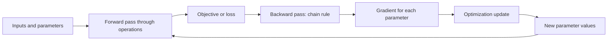

# Sensitivity information for training

A **derivative** describes how a quantity changes when one input changes by a
small amount. If the quantity is a training objective and the input is one
model parameter, the derivative says whether increasing that parameter would
locally increase or decrease the objective, and how strongly. A **gradient**
collects those partial derivatives for all parameters into one object. For a
loss that should decrease, the negative gradient is the local direction of
steepest decrease; for a reward that should increase, the direction is
oriented toward increasing the selected objective.[^google-ml-glossary]

The gradient is local sensitivity, not a promise about the objective far away
from the current parameters. It is also not the same as model uncertainty,
causal influence in the world, or evidence that a parameter has human-
interpretable meaning.

## Computational graphs and the chain rule

A [neural network](neural-networks.md) can be represented as a **computational graph**: nodes carry
values and edges pass the result of one operation to another. A forward pass
starts with inputs and current parameters, applies the operations, and ends
with a prediction and a loss. Each operation has a local derivative describing
how a small change in its input changes its output.

The **chain rule** combines those local sensitivities along a path. If an
output $y$ depends on an intermediate value $u$, and $u$ depends on a
parameter $w$, then

$$
\frac{\partial y}{\partial w} = \frac{\partial y}{\partial u}\frac{\partial u}{\partial w}
$$

For a deep network, many such local factors are multiplied. Backpropagation
computes the objective's derivative with respect to each parameter by traversing
the graph backward and reusing intermediate results. In calculus terms, it is
an efficient implementation of the chain rule for the network's computation;
modern ML libraries generally calculate these derivatives automatically.[^google-backpropagation]

## From gradients to parameter updates

Backpropagation supplies sensitivity information; it does not by itself
choose every training decision. An [optimization and parameter updates](optimization-and-parameter-updates.md)
procedure combines the gradient with a learning rate, batch, constraints, and
possibly additional state to produce new parameter values. A simplified loss
minimization step is:

$$
w_{new} = w_{old} - \eta\nabla_w L
$$

where $L$ is the loss, $w$ is the vector of parameters, and $\eta$ is a
step-size or learning-rate setting. The update is one step in [model training](model-training.md),
not a proof that the loss has reached its global minimum. For a model with a
[Transformer attention architecture](transformer-attention-architecture.md),
the same forward-and-backward idea can span attention, feed-forward, and output
operations; the architecture determines the graph, while training determines
how its parameters are adjusted.

## Limits and failure modes

Gradients can vanish when repeated derivatives become very small, or explode
when they become very large. Either condition can make updates ineffective or
unstable, especially in deep networks.[^google-backpropagation] Non-smooth
operations may require a chosen subgradient or other convention, and discrete
sampling or external feedback may not be differentiable through the whole
system. A differentiable objective can also be a poor proxy for the behavior
that matters in deployment.

Consequently, a decreasing training loss is only evidence about the selected
objective. [Generalization and model evaluation](generalization-and-model-evaluation.md)
checks performance on held-out data and relevant operating conditions; it can
reveal when successful optimization has not produced reliable generalization.

[^google-backpropagation]: Google for Developers, [Neural Networks: Training using backpropagation](https://developers.google.com/machine-learning/crash-course/neural-networks/backpropagation).
[^google-ml-glossary]: Google for Developers, [Machine Learning Glossary](https://developers.google.com/machine-learning/glossary).
