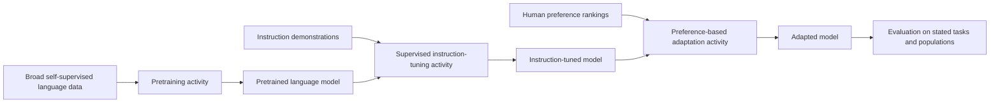

# Why adapt a language model in stages

Language-model adaptation changes an existing model by changing the data and
training signal used for a later [model-training](model-training.md) activity.
The stages are not interchangeable: each supplies different information about
the behavior desired from the model, and each supports only the evaluations
that were actually performed.

The canonical bibliographic records for the primary sources are [InstructGPT (2022)](../references/instructgpt-2022.md) and [Direct Preference Optimization (2023)](../references/dpo-2023.md).

## Broad self-supervised pretraining

The starting point is a large-scale self-supervised language model. DPO describes
such models as learning broad world knowledge and some reasoning skills, while
also noting that unsupervised training alone makes precise behavioral control
difficult.[^dpo-arxiv] In this concept, **pretraining** names that broad,
self-supervised stage: the training target is constructed from the data itself,
so it is often called unsupervised in older descriptions. The papers used here do not
justify a more specific claim about its dataset, architecture, or objective.

The result is a pretrained model entity. Its capabilities and tendencies are
not the same thing as following a particular user's instructions. This is why
later stages change the training data and objective rather than treating the
pretrained model's behavior as a complete specification of desired behavior.

## Supervised instruction tuning and fine-tuning

InstructGPT begins with prompts and labeler-written demonstrations of desired
behavior. The authors use those demonstrations to fine-tune GPT-3 with
supervised learning.[^instructgpt-neurips] This stage supplies example
input/output behavior: the data say what a response should look like for the
provided prompts, and the supervised objective adjusts the model toward those
examples.

**Fine-tuning** is the broader activity of adapting an existing language model
with a later training dataset and objective. **Instruction tuning** is the
particular supervised use of demonstrations intended to improve response to
instructions. These names describe the adaptation activity, not a guarantee
that every instruction or domain will be handled correctly.

## Preference-based adaptation

InstructGPT next uses rankings of model outputs collected from human feedback
to further tune the supervised model with reinforcement learning from human
feedback (RLHF).[^instructgpt-arxiv] The ranking data express relative
preference between candidate outputs rather than a single authored answer for
each prompt. In the procedure described by InstructGPT, a reward model is fit
to reflect those preferences and reinforcement learning then fine-tunes the
language model against the estimated reward.[^dpo-neurips] [Preference learning and reward modeling](preference-learning-and-reward-modeling.md) explains how
those judgments become a proxy reward and how RLHF differs from direct
preference optimization.

DPO describes a different way to use the same broad kind of preference data.
Its parameterization maps the reward-model problem to a direct preference
objective, allowing a single stage of policy training framed as a
classification problem on human preference data. The paper reports that this
removes the need to fit a separate reward model or sample from the language
model during fine-tuning.[^dpo-arxiv] DPO is therefore one preference-based
adaptation method, not a required stage in every language-model pipeline. In
contrast, the RLHF procedure described above uses a [reinforcement-learning feedback loop](reinforcement-learning-feedback-loop.md) to update the
language model against preference-derived rewards; DPO does not require that
reinforcement-learning stage.

## What changes, and what does not

Across these stages, the model entity is repeatedly modified by a distinct
training activity:

* pretraining supplies broad language data and a self-supervised learning
  signal;
* supervised instruction tuning supplies demonstrations of desired responses;
* preference-based adaptation supplies comparative judgments about candidate
  responses and an objective derived from those judgments.

The later stages can change response behavior without proving that the model
has acquired the intended facts, generalized to every instruction, or become
safe in every setting. They also do not make the model an [AI agent](agents.md):
an agent additionally requires a goal-directed control loop, actions, and an
environment.

## Evaluation boundaries

Evaluation evidence is bounded by its prompts, comparison systems, measures,
and population. InstructGPT reports human preferences on its prompt
distribution, improvements in truthfulness and reductions in toxic output
generation, and minimal regressions on public NLP datasets; it also reports
that the resulting models still make simple mistakes.[^instructgpt-neurips]
Those findings support claims about the reported evaluations, not universal
truthfulness, safety, or instruction-following.

DPO reports experiments on sentiment control, summarization, and single-turn
dialogue, including comparisons with PPO-based RLHF.[^dpo-neurips] Those
results support the paper's tested comparisons. They do not by themselves
establish performance for other tasks, users, model families, preference
populations, or deployment conditions. [Generalization and model evaluation](generalization-and-model-evaluation.md)
explains how to keep such claims tied to data, metrics, uncertainty, and
[distribution shift](distribution-shift.md); [AI system evaluation and risk management](ai-system-evaluation-and-risk-management.md)
extends the boundary from a model to its operating system and context.

[Training objectives and signals](training-objectives-and-signals.md) explains
how demonstrations, rankings, losses, rewards, or other feedback become
signals for training. [Machine-learning paradigms](learning-paradigms.md)
provides the broader distinction between self-supervised, supervised, and
reinforcement-based sources of signal. Detailed preference mechanics are
developed in [preference learning and reward modeling](preference-learning-and-reward-modeling.md),
while this concept keeps the broader stage comparison and its evaluation
boundaries.

[^instructgpt-arxiv]: Ouyang et al., [Training language models to follow instructions with human feedback, arXiv:2203.02155](https://arxiv.org/abs/2203.02155).
[^instructgpt-neurips]: Ouyang et al., [Training language models to follow instructions with human feedback, NeurIPS 2022](https://proceedings.neurips.cc/paper_files/paper/2022/hash/b1efde53be364a73914f58805a001731-Abstract.html).
[^dpo-arxiv]: Rafailov et al., [Direct Preference Optimization: Your Language Model is Secretly a Reward Model, arXiv:2305.18290](https://arxiv.org/abs/2305.18290).
[^dpo-neurips]: Rafailov et al., [Direct Preference Optimization: Your Language Model is Secretly a Reward Model, NeurIPS 2023](https://proceedings.neurips.cc/paper_files/paper/2023/hash/a85b405ed65c6477a4fe8302b5e06ce7-Abstract-Conference.html).
