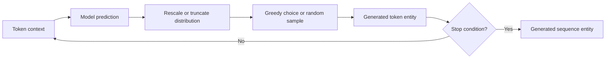

# From a distribution to a sequence

**Language-model decoding** is the activity of turning a model's conditional
predictions into a generated sequence. Given a context represented as ordered
[language tokens](tokenization-and-language-sequences.md), a model produces
scores or a probability distribution for possible next tokens. A decoding
procedure transforms those estimates into a choice, appends the choice to the
context, and may repeat the process through [model inference](model-inference.md).
The generated sequence is an entity produced by this activity; the procedure
does not change the trained model itself.[^google-ml-glossary]

The simplest procedure is **greedy decoding**: choose the currently highest-
probability token at every step. It is deterministic for a fixed model,
context, and configuration, but a locally most likely choice need not produce
the globally best, most coherent, safest, or most truthful sequence. Greedy
decoding also cannot express deliberate variation when several continuations
are plausible.

## Sampling and truncation

**Sampling** treats the next-token distribution as a source of random draws
rather than always selecting its maximum. It can produce different sequences
from the same prompt and configuration. A random seed may make a particular
implementation reproducible, but reproducibility also depends on the exact
model and tokenizer versions, numerical implementation, hardware, context,
and all decoding settings. A seed is therefore a control for an experiment,
not a guarantee that every system will reproduce the result.

**Logits** are the model's unnormalized real-valued scores for candidate next
tokens; $z_i$ denotes the logit for candidate token $i$. A softmax
transformation converts them into probabilities, for example:

$$
p_i = \frac{\exp(z_i)}{\sum_j \exp(z_j)}
$$

Each $p_i$ is nonnegative and the probabilities sum to $1$; a larger logit
gives a larger relative probability, but is not itself a probability.
**Temperature** changes the sharpness of the distribution before sampling. In
one common convention, positive temperature $T$ rescales each logit as
$z_i/T$: lower values make high-scoring choices more dominant, while higher
values flatten the relative preferences. Temperature does not add knowledge
or make an unlikely token true; it changes how the existing scores are used.

**Top-k truncation** retains only the $k$ highest-scoring candidate tokens
before renormalizing their probabilities. **Top-p truncation** (also called
nucleus sampling) retains the smallest candidate set whose cumulative
probability reaches a chosen threshold $p$. These filters trade variety
against access to the model's lower-ranked candidates, and their behavior
depends on the distribution at each step. They are configuration choices, not
general guarantees of quality.

## Stopping and truth limits

Decoding stops when it emits a configured end-of-sequence token, reaches a
maximum token or time budget, satisfies a grammar or application boundary,
or is interrupted by the calling system. The stopping rule is part of the
generation configuration: it determines whether a partial sequence is
returned and can affect downstream interpretation.

A probability or likelihood describes the model's preference under its
training and inference conditions; it is not a truth certificate. A highly
likely continuation can repeat a misconception, reflect bias in its data, or
be wrong in a new context. Conversely, a true or useful statement need not be
the model's most likely continuation. Use [probability and statistical
inference](../science/probability-and-statistical-inference.md) to distinguish
uncertainty and model assumptions from warranted conclusions, and use
[claims, evidence, and inference](../foundations/claims-evidence-and-inference.md)
when checking whether a generated claim is supported.

[Large language models](large-language-models.md) estimate the distributions
that decoding uses, while [model inference](model-inference.md) names the
larger execution activity in which decoding may occur. [Generalization and
model evaluation](generalization-and-model-evaluation.md) explains why
generated outputs must be evaluated under the intended task and context.

[^google-ml-glossary]: Google for Developers, [Machine Learning Glossary](https://developers.google.com/machine-learning/glossary).
