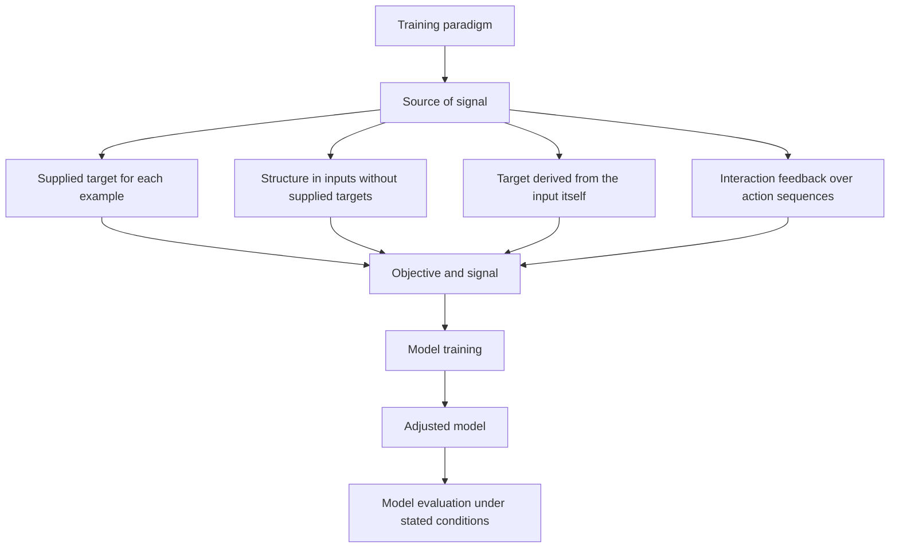

# How the training signal is obtained

A **machine-learning paradigm** is a recurring way of organizing a [model
training](model-training.md) activity around the source and meaning of its
training signal. The paradigm describes how examples, targets, or feedback
are obtained; it does not by itself specify a model architecture or an
[optimization and parameter updates](optimization-and-parameter-updates.md)
algorithm. The same model family can often be trained under more than one
paradigm.[^google-what-is-ml]

## Four common paradigms

* **Supervised learning** trains on examples in which an input is paired with
  a target supplied by a person, instrument, process, or trusted data source.
  The target may be a class, number, ranking, or structured output. The
  training signal measures how the model's output differs from that target.
* **Unsupervised learning** trains without supplied target labels for each
  example. The objective instead exposes structure in the inputs, such as
  groups, compact representations, or unusual cases. “Without labels” does
  not mean without choices: the data representation and objective still
  determine what structure is made visible.
* **Self-supervised learning** derives targets or supervisory signals from
  the data itself. For example, part of an input can be hidden or transformed
  and the model can be trained to predict the withheld or transformed
  information. It therefore uses a supervised-shaped objective while
  obtaining targets without separately authored labels; language-model
  pretraining commonly uses this arrangement.[^google-ml-glossary]
* **Reinforcement learning** learns from interaction with an environment. An
  agent selects actions, receives observations and feedback such as rewards,
  and updates behavior toward better expected outcomes over time. The reward
  is not necessarily an immediate label for the correct action, so credit may
  need to be assigned across a sequence of decisions. The
  [reinforcement-learning feedback loop](reinforcement-learning-feedback-loop.md)
  explains these transitions, returns, and delayed credit more precisely.

These categories can overlap in a system or project. A language model may
first use self-supervised pretraining and later use supervised examples or
reinforcement-based feedback. The useful question is therefore: *what
information makes an output better during this phase of training?* The answer
determines the signal and clarifies what the resulting evaluation can support.

## Relation to objectives and evaluation

[Training objectives and signals](training-objectives-and-signals.md) explains
how a target discrepancy, structural criterion, or reward becomes a value
that guides training. The paradigm says where that value comes from; the
objective says what improvement means. [Generalization and model evaluation](generalization-and-model-evaluation.md)
then tests whether the learned behavior transfers to suitable held-out data,
new inputs, or interaction conditions. A low training loss or high reward is
not by itself evidence that the model will perform well outside those
conditions.

The learned model is an entity produced by the training activity, while each
paradigm is a description of how that activity obtains and interprets its
inputs and feedback. [Model inference](model-inference.md) is a later activity
that applies the resulting model; it is not another learning paradigm.
[Language-model adaptation stages](language-model-adaptation-stages.md) applies
this distinction to a sequence of broad unsupervised pretraining, supervised
instruction tuning, and preference-based adaptation.

[^google-what-is-ml]: Google for Developers, [What is Machine Learning?](https://developers.google.com/machine-learning/intro-to-ml/what-is-ml).
[^google-ml-glossary]: Google for Developers, [Machine Learning Glossary](https://developers.google.com/machine-learning/glossary).
