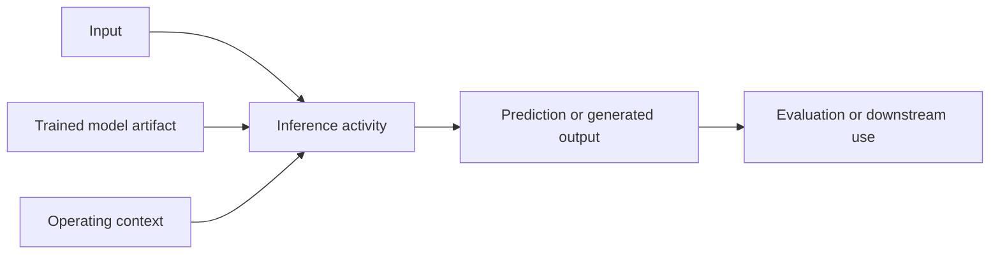

# Applying a trained model

**Model inference** is the activity of applying a trained model to an input in
an operating context so that it produces a prediction, classification, score,
recommendation, or generated output.[^google-what-is-ml] The model is an
artifact produced by [model training](model-training.md); inference uses that
artifact without being the training activity itself. In a simple notation, the
model computes an output $y$ from an input $x$ under context $c$:

$$
y = f_{model}(x; c)
$$

The input may include a prompt, feature values, a document, an image, a sensor
reading, or state supplied by an application. The output may be a probability,
label, numerical estimate, generated sequence, or action recommendation. The
context includes the model and version, preprocessing, available additional
data or tools, configuration, user and environment, and the task for which the
output will be used. [Retrieval and external context](retrieval-and-external-context.md)
describes how an application may select additional records for this context
without changing the trained model artifact.

# Not the same as inferential reasoning

Here, *inference* names a model-execution process: it produces an output by
running a learned mapping. It does not by itself establish that the output is
true, justified, or safe. [Claims, evidence, and inference](../foundations/claims-evidence-and-inference.md)
uses *inferential reasoning* for the relationship by which premises and
evidence support a claim. A model can assist that reasoning, but a generated
answer is not automatically an argument or evidence for its own conclusion.

# Failure and evaluation

Inference can fail because the input is malformed or out of distribution, the
preprocessing or model version is wrong, the context differs from training, the
model is uncertain or biased, a dependency is unavailable, or the output is
misinterpreted or misused. A technically successful run therefore does not
prove a correct result. [Generalization and model evaluation](generalization-and-model-evaluation.md)
explains how to evaluate outputs against the intended task and context using
suitable test data, [prediction tasks and model metrics](prediction-tasks-and-model-metrics.md), and uncertainty. Use operational observations,
and human or domain review where needed. [AI system evaluation and risk management](ai-system-evaluation-and-risk-management.md)
explains why this evidence must cover the complete operating system and its
consequences; [observability and operational readiness](../software-engineering/observability-and-operational-readiness.md)
helps make runtime failures and behavior inspectable.

[Machine learning](machine-learning.md) describes the broader family in which
training and inference occur. [Large language models](large-language-models.md)
perform inference by estimating and generating token sequences from a supplied
context; [tokenization and language sequences](tokenization-and-language-sequences.md)
explains how that context is represented as ordered tokens. When that model uses a Transformer, its attention layers relate the
input positions and produce the contextual representations used by the output
head; see the [Transformer attention architecture](transformer-attention-architecture.md)
and [embeddings and vector representations](embeddings-and-vector-representations.md)
for the vector representations those computations consume and produce.
For language generation, [language-model decoding](language-model-decoding.md)
specifies how those estimates become selected tokens and when generation stops.
An [AI agent](agents.md) may call a model repeatedly as one part of a larger
[agent control loop](agent-control-loops-and-tool-use.md).

[^google-what-is-ml]: Google for Developers, [What is Machine Learning?](https://developers.google.com/machine-learning/intro-to-ml/what-is-ml).
