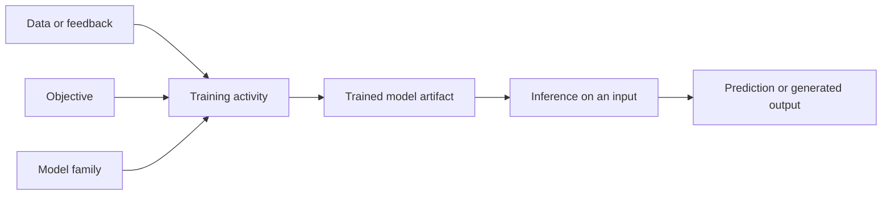

# From data to a trained model

**Model training** is the activity of using examples or feedback, a model
family, an objective, and an optimization procedure to produce a model whose
parameters or structure have been adjusted for a task.[^google-what-is-ml]
The data and objective define what the activity is trying to learn; they do
not by themselves establish that the resulting model is correct or useful.

Training produces a model artifact that can later be used for [model inference](model-inference.md):
applying the adjusted model to an input to obtain a prediction or generated
output. Separating the training activity from the trained model makes it
possible to record the data, code, configuration, and evaluation conditions
that explain how the artifact came to exist. The activity may be supervised,
unsupervised, self-supervised, or reinforcement-based, depending on how its
training signal is obtained.

Training quality must be judged against the intended task and a stated
evaluation procedure. Held-out or newly encountered data provide evidence
about generalization, while [measurement and uncertainty](../foundations/measurement-and-uncertainty.md)
helps interpret that evidence. [Information, data, and records](../foundations/information-data-and-records.md)
helps describe the inputs and resulting artifact, and [semantics and models](../foundations/semantics-and-models.md) explains why a fitted model is a representation rather than the thing it represents.
[Machine learning](machine-learning.md) is the broader family of methods in which
this activity occurs; [large language models](large-language-models.md) are one kind of trained model.

[^google-what-is-ml]: Google for Developers, [What is Machine Learning?](https://developers.google.com/machine-learning/intro-to-ml/what-is-ml).
