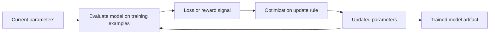

# Changing a model to improve its objective

An **optimization procedure** is the part of [model training](model-training.md)
that uses a training signal to choose changes to a model's parameters. A
**parameter** is a value learned from training data that affects the model's
output; the collection of parameters is part of the trained model artifact.
The procedure is an activity, while the parameter values before and after an
update are entities in the activity's provenance.

The procedure repeatedly evaluates a [training objective and signal](training-objectives-and-signals.md),
then updates parameters in a direction intended to improve that signal. For a
loss that should decrease, gradient-based methods use information about how
the loss changes as parameters change; for a reward that should increase, the
update rule is oriented toward improving the chosen reward. This is a
high-level description: the exact optimizer and update rule depend on the
model, signal, data, and implementation.[^google-ml-glossary]

## Step size and stopping

A **learning rate** or analogous step-size setting controls how large an
update is allowed to be. A larger step can move quickly but overshoot useful
parameter values; a smaller step can be more stable but require more updates.
The procedure may stop after a fixed budget, when the signal or parameters
stop changing enough, or when validation results indicate that further
training is no longer improving the intended task. The stopping rule and
optimizer settings are part of the training configuration, not proof that the
result is optimal.[^google-ml-glossary]

Optimization is not the same as success. The procedure can minimize a loss or
increase a reward while exploiting a proxy, overfitting examples, consuming
too many resources, or producing a model that performs poorly after a change
in operating conditions. [Generalization and model evaluation](generalization-and-model-evaluation.md)
tests the resulting model on suitable held-out or newly encountered data;
[model inference](model-inference.md) describes how the resulting artifact is
then applied to inputs. [Machine learning](machine-learning.md) places this
activity in the wider family of methods, while [training objectives and
signals](training-objectives-and-signals.md) explains what the signal means.

[^google-ml-glossary]: Google for Developers, [Machine Learning Glossary](https://developers.google.com/machine-learning/glossary).
