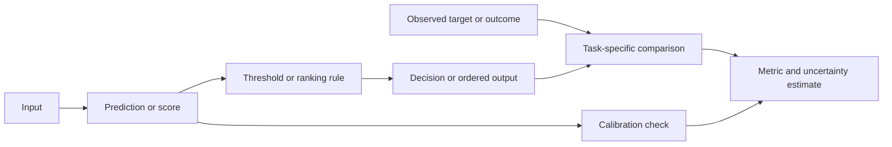

# From a prediction to an evaluation claim

A **prediction task** specifies what an input is meant to produce, what counts
as a target or relevant outcome, and how the output will be used. [Model inference](model-inference.md) produces the output; this concept explains how
to characterize that output and compare it with an observed target or outcome.
The prediction itself is an entity produced by an inference activity, while
scoring and evaluation are activities that produce measurement entities.

## Targets and task families

A **target** is the value or outcome against which a prediction is interpreted.
In **classification**, the target is a class, such as positive/negative or one
of several categories. In **regression**, the target is a numerical quantity.
The [machine-learning paradigms](learning-paradigms.md) determine how such a
target or feedback signal enters training, but the task definition still has
to specify the target independently of the procedure used to learn it.[^google-ml-glossary]

Some systems return a score, a probability-like value, a set of class scores,
an ordered list, or a generated object rather than a final label. A score is
useful only with its meaning, scale, direction, and reference population. A
larger score may indicate greater model preference without being a calibrated
probability or a measure of truth. For ranked retrieval or recommendation,
the output is an ordering; relevance can be evaluated in the first $k$ items,
for example with precision at $k$.[^google-ml-metrics]

## Thresholds, ranking, and calibration

A **classification threshold** converts a continuous binary-classification
output into a class decision. Changing it changes the balance of false
positives and false negatives, so threshold selection is a decision and
evaluation choice rather than a fact discovered automatically by training.[^google-ml-glossary]
Metrics calculated at one fixed threshold, including accuracy, precision, and
recall, can therefore change when the threshold changes.[^google-classification-metrics]

[Model calibration](calibration.md) concerns whether confidence values correspond to observed
frequencies in a stated population. For example, among cases assigned a
confidence near $0.8$, a calibrated system would be correct about $80\%$ of
the time for the defined event and conditions. The dedicated [model calibration](calibration.md)
concept explains the population and outcome-window conditions. Calibration is different from
discrimination: a model can rank positives above negatives well while its
confidence values are systematically too high or too low.

## Choosing metrics

The metric must match the task and the cost of errors. Classification may use
accuracy, precision, recall, or area under a threshold curve; regression may
use an error measure such as mean absolute or squared error; ranking may use a
top-$k$ relevance measure; and probabilistic outputs may need a proper scoring
or calibration measure. Generated or interactive outputs may require several
criteria, such as task success, factual support, safety, latency, and human
review. These are different questions, so no single metric is universally
best.[^google-ml-metrics]

Document the target definition, evaluation population, labels or outcome
window, baseline, threshold or ranking cutoff, metric formula, aggregation,
and relevant subgroups. Link the result to [generalization and model evaluation](generalization-and-model-evaluation.md), which explains held-out
data, distribution shift, and uncertainty, and to [measurement and uncertainty](../foundations/measurement-and-uncertainty.md) when interpreting
estimates.

## What metrics do not establish

A metric is an estimate relative to a task, dataset, measurement process, and
decision rule. A high score does not guarantee that the target was defined
correctly, labels were accurate, the model will generalize after distribution
shift, subgroups will experience equal performance, or a downstream decision
will be beneficial. A calibrated probability is not a guarantee that one case
will have the predicted outcome, and a ranking score is not evidence that the
top item is objectively best. [Claims, evidence, and inference](../foundations/claims-evidence-and-inference.md)
helps state the bounded claim supported by an evaluation result; [AI system evaluation and risk management](ai-system-evaluation-and-risk-management.md)
extends that claim to the complete deployment context and its consequences.
The responsible-AI extension is [responsible AI evaluation and impact](responsible-ai-evaluation-and-impact.md),
which asks how task performance, subgroup effects, privacy, and downstream
consequences should inform a context-bound judgment.

[^google-ml-glossary]: Google for Developers, [Machine Learning Glossary](https://developers.google.com/machine-learning/glossary).
[^google-ml-metrics]: Google for Developers, [Machine Learning Glossary: Metrics](https://developers.google.com/machine-learning/glossary/metrics).
[^google-classification-metrics]: Google for Developers, [Classification: Accuracy, recall, precision, and related metrics](https://developers.google.com/machine-learning/crash-course/classification/accuracy-precision-recall).
