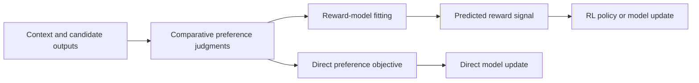

# From preferences to a training signal

Preference learning uses comparative judgments to shape a model when a single
correct target is difficult to specify. For a prompt or situation, an annotator
may compare two candidate outputs and select the preferred one, or indicate a
tie or uncertainty. The resulting pairwise data express a relative ordering
under the annotation instructions; they do not directly reveal an objective
measure of quality.[^instructgpt-arxiv]

The [language-model adaptation stages](language-model-adaptation-stages.md)
concept places this procedure after supervised instruction tuning. The
canonical records for its primary examples are [InstructGPT (2022)](../references/instructgpt-2022.md)
and [Direct Preference Optimization (2023)](../references/dpo-2023.md).

## Preference data and disagreement

An annotation example contains at least a context, candidate outputs, and a
judgment about which candidate is preferred. The judgment depends on the
instructions, annotator population, presentation order, and the qualities being
valued. Annotators can disagree because outputs are close, criteria are
ambiguous, or people hold different preferences. Aggregating judgments can
produce a useful signal, but it does not remove disagreement or establish that
the majority preference is universally correct.

This makes preference data different from an objective label. It is evidence
about a stated judgment process. The [claims, evidence, and inference](../foundations/claims-evidence-and-inference.md)
concept helps separate that evidence from the stronger claim that a model is
helpful, truthful, safe, or aligned in deployment.

## Reward-model fitting

In the RLHF procedure described by [InstructGPT](../references/instructgpt-2022.md),
a reward model is fit to predict the relative preferences in collected
comparisons. Its output is then used as a numerical training signal for a
reinforcement-learning activity that updates the language model.[^instructgpt-neurips]
The reward model is therefore a learned **proxy**: it makes comparative
judgments usable by an optimizer, but it is not identical to the full human
purpose or to welfare in the world.

The [reinforcement-learning feedback loop](reinforcement-learning-feedback-loop.md)
explains the next relationship: preference-derived rewards can guide policy
updates through interaction or sampled sequences. The [training objectives and signals](training-objectives-and-signals.md) concept explains why the reward is
an objective signal, while [optimization and parameter updates](optimization-and-parameter-updates.md)
explains how a training activity changes model parameters.

## RLHF and direct preference optimization

RLHF separates two learned artifacts and activities: fitting a reward model
from preference comparisons, then using reinforcement learning to update the
language model against that estimated reward. This is the relationship between
preference learning and the policy-update loop; a preference judgment is not
itself a policy or an action.

[Direct Preference Optimization (DPO)](../references/dpo-2023.md) describes a
distinct route. Its parameterization turns a preference model into a direct
objective for policy training, so the reported procedure does not require a
separately fitted reward model or the same reinforcement-learning fine-tuning
stage.[^dpo-arxiv] DPO is therefore not a required replacement stage for every
RLHF system, and RLHF and DPO should not be treated as synonymous names for one
algorithm.[^dpo-neurips]

## Limits and evaluation boundaries

Preference-based training can improve the behavior represented in the collected
comparisons without proving that the model learned the intended underlying
value. Important limits include:

* **Noise and disagreement:** inconsistent, ambiguous, or systematically
  incomplete judgments can become an unstable or biased signal.
* **Reward misspecification:** a reward model can fit the comparisons while
  assigning high scores to outputs that exploit gaps in the data or objective.
* **Generalization:** a preference signal learned for one prompt distribution,
  population, or task may not transfer to other users, domains, languages, or
  deployment conditions.
* **Evaluation validity:** improvements in a reported preference score support
  only claims bounded by the comparison protocol and evaluation population.
  [Generalization and model evaluation](generalization-and-model-evaluation.md)
  explains this boundary; [AI system evaluation and risk management](ai-system-evaluation-and-risk-management.md)
  extends it to the operating system and context.

Preference learning produces evidence-supported behavior, not a proof of
truthfulness, safety, or human benefit. The [responsible AI evaluation and impact](responsible-ai-evaluation-and-impact.md) concept addresses affected
groups, harms, privacy, security, and accountability that a preference score
alone cannot establish.

[^instructgpt-arxiv]: Ouyang et al., [Training language models to follow instructions with human feedback, arXiv:2203.02155](https://arxiv.org/abs/2203.02155).
[^instructgpt-neurips]: Ouyang et al., [Training language models to follow instructions with human feedback, NeurIPS 2022](https://proceedings.neurips.cc/paper_files/paper/2022/hash/b1efde53be364a73914f58805a001731-Abstract.html).
[^dpo-arxiv]: Rafailov et al., [Direct Preference Optimization: Your Language Model is Secretly a Reward Model, arXiv:2305.18290](https://arxiv.org/abs/2305.18290).
[^dpo-neurips]: Rafailov et al., [Direct Preference Optimization: Your Language Model is Secretly a Reward Model, NeurIPS 2023](https://proceedings.neurips.cc/paper_files/paper/2023/hash/a85b405ed65c6477a4fe8302b5e06ce7-Abstract-Conference.html).
