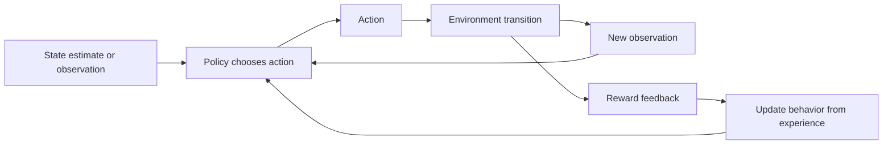

# Learning from interaction

**Reinforcement learning** is a machine-learning setting in which an acting
system learns from repeated interaction with an environment. Instead of
receiving a correct target for every action, it receives observations and
feedback about the outcomes of its choices. The [machine-learning paradigms](learning-paradigms.md) concept distinguishes this source of signal
from supervised, unsupervised, and self-supervised learning.[^google-ml-glossary]

The interaction can be described with a few roles:

* The **environment** is the part of the world or simulation outside the
  learner that responds to actions.
* A **state** is the information used to describe the situation relevant to a
  decision. The learner may have only a partial or imperfect state estimate.
* An **observation** is what the learner receives about the current situation
  or the result of an action. An observation need not reveal the complete
  state.
* An **action** is a choice the learner can attempt through the environment's
  interface. The available actions and their constraints are part of the
  problem definition.
* A **policy** is a rule or learned mapping from available information to an
  action choice. It may choose the same action reliably or represent
  uncertainty over alternatives.
* A **reward** is feedback assigned to an outcome or transition. It expresses
  what the training setup values, but it is only a proxy for the broader goal.

These roles are related but not interchangeable. The [agent](agents.md) is
the acting system; the policy is the behavior-selection rule it uses. The
[agent control loop and tool-use](agent-control-loops-and-tool-use.md) concept
covers general runtime controls, while this concept focuses on how interaction
feedback can change the policy over many decisions.

In language-model adaptation, [language-model adaptation stages](language-model-adaptation-stages.md)
describes RLHF as one application of this feedback procedure: preference
judgments are transformed into rewards that guide reinforcement-learning
updates. [Preference learning and reward modeling](preference-learning-and-reward-modeling.md)
explains the intermediate reward-model proxy and the distinction from DPO.
Direct Preference Optimization (DPO) is a distinct preference-based adaptation
method, so it is not a required reinforcement-learning stage.

## Transitions and return

One interaction step has a **transition** from a current situation to a later
situation: the learner observes information, selects an action, the environment
changes, and the learner receives a new observation and reward. A sequence of
such steps is an episode or continuing interaction, depending on whether the
task has a natural stopping point.

The value of a single reward may not capture the value of a sequence. The
**return** is the accumulated reward attributed to a point in the interaction.
A simple undiscounted finite sequence can be written as

$$
G_t = r_t + r_{t+1} + \cdots + r_T
$$

where $r_t$ is the reward at step $t$. A **discount factor** weights later
rewards less strongly when that is appropriate for the task:

$$
G_t = r_t + \gamma r_{t+1} + \gamma^2 r_{t+2} + \cdots,
\qquad 0 \leq \gamma \leq 1
$$

Discounting is a modeling choice about how consequences separated in time
enter the objective; it is not a guarantee that immediate outcomes are more
important in the real world. [Training objectives and signals](training-objectives-and-signals.md)
explains how reward becomes a training signal, and [risk and decision](../foundations/risk-and-decision.md)
explains why the relevant consequences and criteria must be stated rather than
assumed.

The diagram shows two related loops. The inner loop produces experience by
acting and observing. Across many steps, the reward and observed transitions
provide experience from which a training activity can improve a policy. A
reward received now may depend on choices made earlier, so **delayed credit
assignment** is the problem of relating a later outcome to the earlier actions
that contributed to it. A high reward does not prove that every preceding
action was good, and a low reward does not identify a single cause without
further evidence.

## Exploration, exploitation, and limits

The learner faces an **exploration–exploitation** tension. **Exploration**
tries alternatives to learn what they do; **exploitation** chooses an action
that current information already suggests will perform well. Exploring can
improve future decisions but can also incur immediate cost or risk. A policy
therefore needs an explicit action space, objective, stopping or safety
condition, and evaluation context; “learn the best action” is incomplete
without those choices.

The [actions, policies, and permissions](../foundations/actions-policies-and-permissions.md) concept adds an important boundary: a policy's proposed action is not
automatically an authorized action. In a deployed system, the [agent control loop](agent-control-loops-and-tool-use.md) can check permissions, require
approval, record observations, and stop unsafe transitions before execution.

The loop also does not establish that reward equals human well-being or the
system's full objective. An incomplete reward can encourage an unintended
shortcut; noisy observations can make the state estimate misleading; limited
exploration can leave important alternatives untested; and an environment can
change after training. [Generalization and model evaluation](generalization-and-model-evaluation.md)
provides the model-level evaluation boundary, while [causation and dependency](../foundations/causation-and-dependency.md) helps distinguish a
correlation in experience from evidence that an action caused an outcome.
Evaluation should therefore test the policy in relevant operating conditions,
measure uncertainty and downstream consequences, and treat a learned policy
as evidence-supported behavior rather than a universal guarantee.

[^google-ml-glossary]: Google for Developers, [Machine Learning Glossary](https://developers.google.com/machine-learning/glossary).
