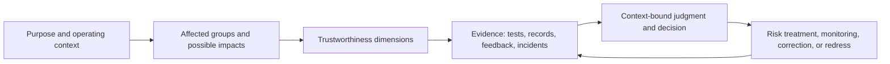

# Evaluate impacts, not just scores

Responsible AI evaluation asks whether an AI system is trustworthy and acceptably
used for a stated purpose, population, and operating context. It examines the
model, data, interfaces, operators, deployment controls, and consequences
together. A model score is therefore one evidence entity in a larger evaluation
activity, not a complete judgment about the system or its effects.

NIST AI RMF 1.0 organizes risk management into Govern, Map, Measure, and Manage;
the Generative AI Profile applies that framing to generative-AI lifecycle risks
and trustworthiness considerations.[^nist-ai-rmf-1-0][^nist-ai-600-1] The profile
is available as the [local NIST AI 600-1 PDF](../references/nist-ai-600-1.pdf)
and from its [canonical NIST PDF URL](https://nvlpubs.nist.gov/nistpubs/ai/NIST.AI.600-1.pdf).

## Dimensions and affected groups

Begin by identifying people, organizations, communities, operators, and other
entities that may be affected directly or through downstream decisions. The
relevant dimensions are questions to investigate, not a universal checklist
whose presence proves trustworthiness:

* **Fairness and harmful bias:** Do errors, opportunities, burdens, and quality
  differ unjustifiably across relevant groups? Define the groups, comparison,
  target, and decision context; aggregate parity can conceal intersectional or
  context-specific harm.
* **Privacy:** What personal or sensitive information is collected, inferred,
  memorized, exposed, or made available through outputs and logs? State the
  purpose, authority, retention, access, and consequences of disclosure.
* **Security and resilience:** Can the system, its data, dependencies, or
  controls be manipulated, extracted, unavailable, or degraded, and can it
  recover while preserving confidentiality, integrity, authenticity, and
  availability? See [security properties and integrity](../foundations/security-properties-and-integrity.md).
* **Transparency and explainability:** Can relevant users understand the
  system's purpose, limits, inputs, outputs, and decision-relevant reasons at a
  level appropriate to the use? An explanation is not automatically a faithful
  account of the mechanism.
* **Accountability:** Are roles, decision rights, escalation, correction, and
  redress assigned to identifiable actors with enough records to review what
  happened? Technical provenance supports this inquiry but does not by itself
  assign moral or organizational responsibility.

These dimensions interact. For example, collecting detailed demographic data
may help measure subgroup performance while increasing privacy exposure; a
security control may restrict access to evidence needed for accountability.
Record the trade-off, authority, residual uncertainty, and affected parties
instead of collapsing the result into one trust label.

## From evidence to an impact decision

An impact assessment defines the intended use, affected groups, plausible
benefits and harms, evaluation questions, evidence sources, decision criteria,
and routes for human review or remedy. Use [prediction tasks and model metrics](prediction-tasks-and-model-metrics.md)
and [generalization and model evaluation](generalization-and-model-evaluation.md)
for model and task evidence, then extend the boundary to deployment and lived
effects through [AI system evaluation and risk management](ai-system-evaluation-and-risk-management.md).
The [claims, evidence, and inference](../foundations/claims-evidence-and-inference.md)
concept helps distinguish an observed disparity or incident from the stronger
claim that a system caused it; [models and causality](../science/models-and-causality.md)
helps identify competing explanations when impact attribution is uncertain.

Use [information provenance and trust](../information-systems/information-provenance-and-trust.md)
to record data, versions, transformations, evaluators, and timestamps; use
[observability and operational readiness](../software-engineering/observability-and-operational-readiness.md)
to inspect runtime behavior, failures, and responses. [Digital identity and authorization](../cybersecurity/digital-identity-and-authorization.md) limits
who may access sensitive evaluation data or approve a consequential action, and
[security properties and integrity](../foundations/security-properties-and-integrity.md)
defines the protections those records and interfaces require.

An [assurance case](../assurance/assurance-case.md) can organize the claim,
assumptions, evidence, rebuttals, and review outcome. [Risk and decision](../foundations/risk-and-decision.md)
turns uncertain impacts and consequences into a stated response. The ethical
question is not settled by the system's causal contribution alone: [moral agency and responsibility](../ethics/moral-agency-and-responsibility.md) examines
capacity, knowledge, control, and opportunity, while [shared responsibility and excuses](../ethics/shared-responsibility-and-excuses.md) helps analyze how
responsibility may be distributed across designers, deployers, operators, and
institutions.

## Limits of the judgment

Responsible-AI evaluation supports a decision bounded by the tested task,
population, data, time, deployment, evidence quality, and assumptions. It does
not establish universal fairness, privacy, safety, security, explainability, or
absence of harm. Missing data, unobserved groups, changing conditions, strategic
behavior, measurement error, and feedback effects can weaken the inference.
Passing a benchmark or finding no incident means only that the specified search
did not reveal a failure under its coverage; it is not evidence that no failure
exists. Re-evaluate after material changes to the model, data, interfaces,
users, environment, stakes, or controls, and preserve routes for affected people
to question, correct, appeal, or obtain remedy where appropriate.

[^nist-ai-rmf-1-0]: NIST, [Artificial Intelligence Risk Management Framework (AI RMF 1.0)](https://doi.org/10.6028/NIST.AI.100-1).
[^nist-ai-600-1]: NIST, [Artificial Intelligence Risk Management Framework: Generative Artificial Intelligence Profile (NIST AI 600-1)](https://nvlpubs.nist.gov/nistpubs/ai/NIST.AI.600-1.pdf); repository artifact: [NIST AI 600-1 PDF](../references/nist-ai-600-1.pdf).
