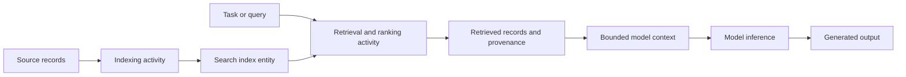

# Use information outside the model

**Retrieval** is an activity that selects information entities from an external
collection in response to a query, task, or current context. The collection
may be documents, records, database rows, APIs, or other governed sources. A
retrieval system normally prepares an **index**, accepts a **query**, finds
candidate items, and **ranks** or filters them before returning a bounded set
of results. An index is a derived structure for finding items; it is not a
replacement for the source records or their provenance.

One common index represents source items and queries as vectors in a shared
[embedding space](embeddings-and-vector-representations.md), then uses a
similarity measure to generate candidates. Other systems use exact fields,
lexical terms, graph relationships, metadata filters, or a combination. A
candidate-generation stage finds potentially relevant items; ranking applies a
more specific relevance rule. Similarity or rank is an operational selection
signal, not proof that a result is true, current, complete, or safe.[^google-embedding-space][^google-candidate-generation]

# Grounding and context windows

**Grounding** is using selected source material to condition part or all of a
model output. **Retrieval-augmented generation (RAG)** is a common grounding
pattern: an application retrieves information after model training, appends or
otherwise supplies it with the request, and asks the model to produce an
output based on that context.[^google-ml-glossary][^google-rag-architecture] The
retrieved records remain external entities; putting their text into a prompt
does not turn them into model parameters.

The supplied material must fit the model's **context window**, the number of
tokens the model can process in one prompt. An application may chunk records,
remove duplicates, select passages, summarize, or prioritize recent and
authoritative results. These are information-loss and policy decisions: a
larger context can still contain irrelevant, contradictory, malicious, or
stale material, and a model may fail to use every supplied passage. See
[tokenization and language sequences](tokenization-and-language-sequences.md)
for how context becomes an ordered token sequence and [model inference](model-inference.md)
for the execution that consumes it.

Grounding improves access to selected information but does not guarantee a
factual answer. The source may be wrong, the retriever may omit the needed
record, the ranker may prefer a misleading passage, or the model may
misinterpret or overrule the evidence. Preserve source identifiers, versions,
timestamps, access decisions, and the passages actually supplied so a reader
can inspect the relationship through [information provenance and trust](../information-systems/information-provenance-and-trust.md).

# Three kinds of stored state

Retrieval systems and agents should distinguish at least three things:

1. **Model parameters** are learned state produced by [model training](model-training.md)
   or adaptation. They encode behavior and statistical regularities in a
   distributed form. Updating them is a training activity, not an ordinary
   query, and the parameters do not automatically reveal which source produced
   a particular output.
2. **Retrieved evidence or context** consists of source entities selected for a
   particular request. It is request-scoped, can change as sources and indexes
   change, and should retain provenance and access conditions. It can inform an
   output without becoming durable model knowledge.
3. **Agent memory** consists of records retained for later interactions, such as
   an episode, user preference, task state, or learned summary. It is a system
   design choice outside the model's parameters. Memory can be retrieved as
   context, but retention does not make a record accurate, authorized, or
   appropriate to reuse; apply lifecycle, privacy, access, and correction rules.

An [agent](agents.md) may combine all three: model parameters propose an
interpretation, retrieval supplies external records, and memory supplies
prior agent state. The [agent control loop and tool use](agent-control-loops-and-tool-use.md)
concept explains how a tool call can retrieve and observe data, while this
concept explains what kind of information that observation is. Neither a
retrieved passage nor a memory record is automatically a justified [claim, evidence, and inference](../foundations/claims-evidence-and-inference.md).

# Interfaces, operations, and limits

Retrieval is an interface between an application and an information source.
Its [API and interface design](../software-engineering/api-and-interface-design.md)
should specify query and result schemas, ranking and filtering behavior,
pagination, permissions, freshness, errors, timeouts, and whether repeated
requests are reproducible. A retrieval call is an activity with an input
query, an execution context, returned entities, and possible errors; the
interface contract does not guarantee that the returned content is relevant
or true.

Instrument indexing, query latency, empty and low-confidence results, ranking
quality, source freshness, access denials, context size, citations, and memory
reads and writes. [Observability and operational readiness](../software-engineering/observability-and-operational-readiness.md)
helps operators inspect those runtime signals. Also evaluate access control,
prompt injection, data poisoning, sensitive-data leakage, stale indexes,
duplicate or conflicting sources, retrieval bias, and context overload. The
right response may be to refuse, ask for clarification, narrow the source set,
or require human review rather than generate a confident answer.

This concept deliberately keeps retrieval, grounding, and memory together as
one system boundary because they are often confused in practice. If the graph
later needs algorithmic treatment of a particular index, ranking model, or
memory policy, that mechanism can be decomposed into its own canonical node.

[^google-ml-glossary]: Google for Developers, [Machine Learning Glossary](https://developers.google.com/machine-learning/glossary).
[^google-embedding-space]: Google for Developers, [Embedding space and static embeddings](https://developers.google.com/machine-learning/crash-course/embeddings/embedding-space).
[^google-candidate-generation]: Google for Developers, [Candidate generation overview](https://developers.google.com/machine-learning/recommendation/overview/candidate-generation).
[^google-rag-architecture]: Google Cloud, [RAG infrastructure for generative AI using Agent Platform and Vector Search](https://docs.cloud.google.com/architecture/gen-ai-rag-vertex-ai-vector-search).
