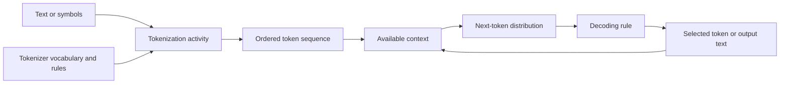

# From text to tokens

**Tokenization** is the activity of converting a text representation into a
sequence of tokens that a language model can process. A token may be a whole
word, part of a word, punctuation, whitespace, or another symbol, depending on
the model's tokenizer. The tokenizer's **vocabulary** is the finite set of
token types it knows; the same text can therefore produce different token
sequences for different vocabularies and tokenization rules.[^google-ml-glossary]

The resulting sequence is data, not the underlying language or meaning. A
token sequence preserves only the distinctions that the tokenizer and its
vocabulary encode. Decoding reverses the representation approximately by
turning token identifiers back into text; it cannot recover distinctions that
were discarded or never represented. This is an application of
[information, data, and records](../foundations/information-data-and-records.md):
the representation has a form and an interpretation supplied by its model
context. A model may next map token identifiers into [embeddings and vector representations](embeddings-and-vector-representations.md), which provide
numeric inputs for learned transformations without becoming the language or
meaning themselves.

# Context and next-token targets

A **sequence** is an ordered list of tokens. A token's **context** is the
earlier or otherwise available sequence information used to interpret or
predict it. In autoregressive language modeling, the training target at a
position is commonly the next token in an example sequence. The model learns a
conditional distribution such as $P(t_{n+1} \mid t_1,\ldots,t_n)$, where each
$t_i$ is a token and the vertical bar means “given.” The distribution expresses
relative model scores or probabilities; it is not a guarantee that the most
likely token is true or appropriate.

At inference time, [model inference](model-inference.md) supplies a context,
the model estimates a next-token distribution, and [language-model decoding](language-model-decoding.md)
selects a token or otherwise constructs an output from those estimates. Repeating this
step extends the sequence until a stopping condition, length limit, or
application boundary is reached. The context window limits how much sequence
information the model can use in one computation, and the application may add
instructions, retrieved records, or other data to that context.
[Retrieval and external context](retrieval-and-external-context.md) explains
how those records are selected and why supplied context is not the same as
learned model parameters or durable agent memory.

Tokenization and decoding are part of the model's interface and operating
context, not interchangeable with [inferential reasoning](../foundations/claims-evidence-and-inference.md).
Different tokenizers can change sequence length, available context, and how
efficiently a model handles unusual words or symbols. These representation
choices affect behavior, but a fluent decoded sequence is still a generated
[information, data, and record](../foundations/information-data-and-records.md),
not by itself evidence that its claims are correct.

[Large language models](large-language-models.md) use token sequences as a
central input and output representation. They are a specialized case of
[machine learning](machine-learning.md), while [model training](model-training.md)
defines how examples and objectives adjust the model that estimates the
next-token distribution. Tokenization is therefore a representation activity,
whereas training and inference are distinct activities that use its result.

[^google-ml-glossary]: Google for Developers, [Machine Learning Glossary](https://developers.google.com/machine-learning/glossary).
