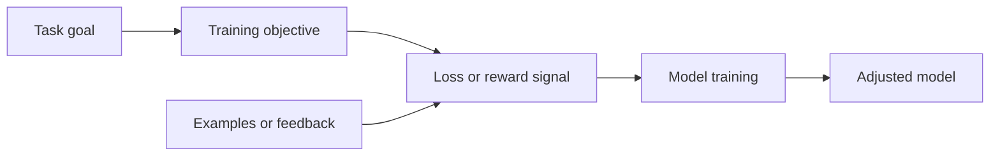

# What training optimizes

A **training objective** states what a [model training](model-training.md)
activity is intended to improve. A **training signal** is the information used
to measure or communicate progress toward that objective. The objective and
signal are information entities that guide an activity; they are not the
parameter-update procedure itself.

In common forms, a **loss** is a numerical measure of undesirable discrepancy
between a model's output and a target, so training seeks to minimize it. A
**reward** is feedback about the value of an outcome, so reinforcement learning
usually seeks to maximize expected cumulative reward. The same design can be
written with opposite signs—for example, minimizing negative reward—so the
important distinction is what the value means and how the training procedure
uses it.[^google-ml-glossary]

The signal is only a proxy for the intended task. A model can improve its
training loss or reward while learning a shortcut, overfitting its examples,
or failing under changed conditions. [Generalization and model evaluation](generalization-and-model-evaluation.md)
explains how to compare results on held-out or newly encountered data, and
interpret those measurements with
[measurement and uncertainty](../foundations/measurement-and-uncertainty.md).

[Machine learning](machine-learning.md) uses objectives and signals to turn a
task into a learnable procedure. [Model training](model-training.md) combines
the signal with data, a model family, and [optimization and parameter updates](optimization-and-parameter-updates.md); the
optimizer changes parameters, while the loss or reward indicates the
direction and degree of improvement.

[^google-ml-glossary]: Google for Developers, [Machine Learning Glossary](https://developers.google.com/machine-learning/glossary).
