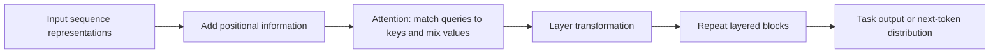

# What the architecture does

A **Transformer** is a layered model architecture for transforming a sequence
of input representations into contextual representations and, when configured
for a task, an output sequence or other prediction. The architecture is an
artifact (an `Entity`); running its attention and transformation operations is
an `Activity`. The original Transformer replaced recurrence and convolution in
its sequence-transduction design with attention-based computation, enabling
more parallel computation during training.[^transformer-paper]

## Attention relates positions

Attention lets each position form a weighted combination of information from
other positions in the same context. This gives the model a way to use a
nearby word, a distant word, or another relevant element when constructing the
representation at the current position. The weights are computed from three
roles:

- A **query** represents what the current position is looking for.
- A **key** represents what each available position offers for matching.
- A **value** is the information contributed when a key is given weight.

At a high level, the model compares a query with keys, normalizes the resulting
compatibility scores into weights, and combines the corresponding values. The
result is a context-sensitive representation, not a claim that the model has
identified the uniquely correct meaning. In simplified notation:

$$
\operatorname{attention}(Q,K,V) = \operatorname{normalize}(\operatorname{match}(Q,K))V
$$

The query, key, and value roles are computational roles and need not
correspond to words or human questions. Different attention heads can learn
different relations, while later layers transform the resulting
representations again.

## Order and layers

Attention by itself can compare positions without processing them in a fixed
left-to-right recurrence. A Transformer therefore supplies **positional
information** so that representations can distinguish different arrangements
of an otherwise identical set of elements. Positional information may be
encoded or added by the particular model; the architecture requires that order
be represented somehow, not one universally prescribed encoding.

The model applies several layers of transformations. Each layer can update a
position using attention to the context and a learned position-wise
transformation. Repeating this process builds representations that combine
local and long-range context. A decoder or output head then converts the final
representations into task-specific predictions, such as the next-token
distribution used during [model inference](model-inference.md).

The architecture does not determine the training data, objective, decoding
policy, or deployment quality. [Model training](model-training.md) explains how
parameters are adjusted, and [model inference](model-inference.md) explains
what it means to run a trained model on an input. [Large language models](large-language-models.md)
are one important family that commonly uses Transformer architectures, but a
Transformer is not itself synonymous with an LLM.

[^transformer-paper]: Vaswani et al., [Attention Is All You Need](https://arxiv.org/abs/1706.03762), as preserved in the bundle's [paper record](../references/attention-is-all-you-need.md).
