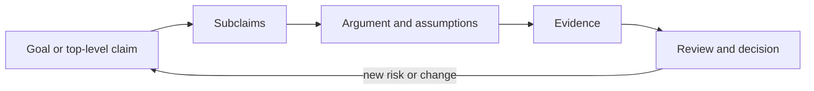

# Claim, argument, and evidence

An **assurance case** is an auditable artifact that makes a structured
argument for a claim about a system or process, supported by tangible evidence
under a stated context.[^iso-assurance-case] It should expose the claim,
subclaims, reasoning, evidence, assumptions, scope, and limits rather than
compressing them into an unsupported “compliant” or “trustworthy” label.

The central distinction is between **evidence** and the **argument** that
explains why that evidence supports a claim. A test result, event record,
identity assertion, or review is not self-interpreting. State what property is
being assured, which evidence bears on it, why the evidence is sufficient for
the stated context, and what would weaken or rebut the conclusion.[^nist-assurance-case]

This reasoning uses the foundational distinctions among [claims, evidence, and inference](../foundations/claims-evidence-and-inference.md), [systems, processes, and boundaries](../foundations/systems-processes-and-boundaries.md), [risk and decision](../foundations/risk-and-decision.md), and [roles, authority, and organizations](../foundations/roles-authority-and-organizations.md).

For the applied reasoning step, see [argument validity and rebuttal](../reasoning/argument-validity-and-rebuttal.md).

# Building and maintaining a case

1. Define the system, operating context, stakeholders, quality property, and
   top-level claim.
2. Decompose the claim into reviewable subclaims and identify assumptions,
   risks, exclusions, and decision criteria.
3. Gather evidence with enough identity, timestamps, scope, integrity, and
   provenance to show what was actually examined. [Information provenance and trust](../information-systems/information-provenance-and-trust.md)
   supplies the lineage model; [evidence and scientific claims](../science/evidence-and-scientific-claims.md)
   supplies methods for judging uncertainty, bias, and replication.
4. Explain the inference from each evidence item to its subclaim, and record
   unresolved gaps instead of treating missing evidence as a successful result.
5. Reassess the case when the system, dependencies, threats, operating context,
   or evidence changes. [Software dependency and compatibility](../software-engineering/software-dependency-and-compatibility.md)
   helps identify changes to the shipped artifact, while [product provenance](../supply-chains/product-provenance.md)
   provides an event-oriented pattern for tracing physical or digital objects.

An [agent control loop](../artificial-intelligence/agent-control-loops-and-tool-use.md)
can supply reviewable evidence about proposed actions, approvals, tool traces,
observations, verification, and bounded retries. Security and access claims also depend on knowing which subject acted and who
could perform or approve an activity; [digital identity and authorization](../cybersecurity/digital-identity-and-authorization.md)
provides those controls. A case may support an ethical or organizational
decision, but it does not mechanically settle responsibility: [moral agency and responsibility](../ethics/moral-agency-and-responsibility.md)
explains why control, knowledge, authority, and opportunity still require
judgment.

# Learning application

Constructing a small assurance case is an applied competency: the learner
must define a claim, select relevant evidence, justify the connection, and
identify uncertainty. This makes [competency and prerequisite structure](../education/competency-and-prerequisite-structure.md)
useful for designing and assessing practice without confusing completion of a
template with mastery.

An assurance case is not proof that a system is risk-free. It is a reviewable,
context-bound justification whose confidence depends on evidence quality,
argument validity, coverage, independence, and the freshness of the case.
For an AI-specific application, [responsible AI evaluation and impact](../artificial-intelligence/responsible-ai-evaluation-and-impact.md)
organizes trustworthiness dimensions, affected-party impacts, and residual
risk as claims and evidence that can enter such a case.
The SEI describes the same claim–argument–evidence structure for security
assurance and emphasizes that evidence must apply to the released system and
the practices actually performed.[^sei-arguing-security]

[^nist-assurance-case]: NIST, [CSRC Glossary: assurance case](https://csrc.nist.gov/glossary/term/assurance_case).
[^iso-assurance-case]: ISO/IEC/IEEE, [15026-2:2022 Systems and software engineering — Assurance case](https://www.iso.org/obp/ui?_escaped_fragment_=iso:std:iso-iec-ieee:15026:-2:ed-2:v1:en).
[^sei-arguing-security]: Carnegie Mellon Software Engineering Institute, [Arguing Security — Creating Security Assurance Cases](https://www.sei.cmu.edu/library/arguing-security-creating-security-assurance-cases/).
