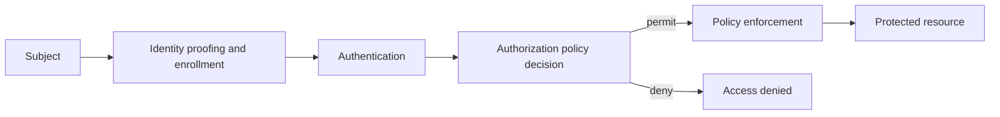

# Core distinction

A **digital identity** is the set of attributes and credentials used to
represent a subject—such as a person, organization, device, or service—in a
digital system. Identity proofing establishes how strongly an identity is
bound to a real-world subject; authentication tests control of an
authenticator; and federation communicates an identity and its authentication
result between domains.[^nist-digital-identity]

**Authorization** is the decision about whether an authenticated subject may
perform a requested action on a particular resource in a stated context. It
is therefore different from authentication: authentication supplies evidence
about *who or what is acting*, while authorization evaluates *what that actor
may do*. NIST's zero-trust model treats subject and device authentication and
authorization as discrete functions before a session to an enterprise
resource is established.[^nist-zero-trust]

# Access-control flow

The practical flow is:

1. **Enroll and manage identity.** Bind identifiers and authenticators to a
   subject, while handling changes, recovery, suspension, and revocation.
2. **Authenticate.** Verify an authenticator or assertion, selecting an
   assurance level appropriate to the risk. A successful login does not by
   itself grant every permission.
3. **Decide authorization.** Evaluate a policy using the subject, requested
   action, resource, and relevant context such as device state, time, or
   risk. Policies should express least privilege and separation of duties
   where those controls reduce harm.
4. **Enforce and observe.** Apply the decision at the resource boundary,
   limit the scope and lifetime of delegated credentials, and record enough
   events to review access and investigate misuse.

# Delegation and tokens

OAuth illustrates the separation between authentication and delegated
authorization. A resource owner authorizes a client through an authorization
server; the server issues an access token with a scope and lifetime; and the
client presents that token to a resource server. The client does not need the
resource owner's password, and the token represents limited access rather than
the owner's complete identity.[^oauth-rfc]

Tokens are not automatically trustworthy merely because they exist. The
resource server must validate their issuer, audience, integrity or
introspection result, expiry, and permitted scope, and must still apply local
authorization policy. Revocation, rotation, phishing resistance, strong
authentication, and protection of recovery paths are lifecycle concerns rather
than one-time configuration tasks.

Shared event records also need this identity and authorization foundation: a
product-provenance system must be able to distinguish which party or system
asserted an event and control who may append, correct, or read sensitive
details. See [product provenance](../supply-chains/product-provenance.md) for
the supply-chain application.

# Security boundaries and common errors

- Treating a username, an authentication result, and an authorization grant
  as interchangeable.
- Granting permissions from network location or possession of a valid token
  alone; zero trust assumes no implicit trust based only on location or
  ownership.[^nist-zero-trust]
- Issuing broad, long-lived credentials when a resource-specific, short-lived
  scope would suffice.
- Failing to re-evaluate authorization when privilege, device posture,
  resource sensitivity, or risk changes.
- Omitting auditability, revocation, and a usable recovery process, thereby
  turning identity compromise into durable access.

The right design is risk- and context-dependent: assurance requirements,
policy language, token format, and enforcement architecture must fit the
resources and threats being addressed. NIST SP 800-63-4 focuses on identity
proofing, authentication, and federation; it does not by itself define every
application's authorization policy.[^nist-digital-identity]

[^nist-digital-identity]: NIST, [SP 800-63-4 Digital Identity Guidelines](https://doi.org/10.6028/NIST.SP.800-63-4).
[^nist-zero-trust]: NIST, [SP 800-207 Zero Trust Architecture](https://doi.org/10.6028/NIST.SP.800-207).
[^oauth-rfc]: IETF, [RFC 6749: The OAuth 2.0 Authorization Framework](https://www.rfc-editor.org/rfc/rfc6749).
