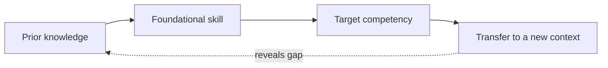

# Competencies and prerequisites

A **competency** is an observable capability: what a learner can understand,
produce, explain, decide, or do under stated conditions and quality criteria.
A **prerequisite** is a prior concept, skill, language, or disposition that
materially enables a later competency. A prerequisite graph is a model of
dependencies, not a claim that all learning is strictly linear.

Define each competency with a context, performance, and evidence of mastery.
Then identify the smallest prerequisites needed to explain or perform it;
avoid labeling every related fact as mandatory. A learner may satisfy a
prerequisite through different routes, and a single prerequisite may support
several competencies.

# Learning design

The National Academies reports that prior knowledge changes the attentional
demands of learning and that the effectiveness of learning strategies depends
on existing skills, prior knowledge, the material, and the learner's goals.
Therefore, diagnose entry knowledge, make prerequisite relationships visible,
teach missing foundations, and revisit them in meaningful contexts rather than
assuming a fixed sequence works for everyone.[^how-people-learn-ii]

Use checks that reveal reasoning, not only recognition. A learner can remember
a definition yet fail to apply it; conversely, they may demonstrate a
competency using a valid route that differs from the author's sequence. Record
uncertainty about mastery and distinguish “not yet demonstrated” from “not
known.”

# Graph maintenance

Prerequisite edges should explain why one node helps with another and should
be reviewed when the target competency, audience, or assessment changes. Link
to the canonical concept rather than creating duplicate “easy” versions. In
this bundle, the graph can support a lesson plan for [evidence and scientific claims](../science/evidence-and-scientific-claims.md) by exposing missing
concepts before asking a learner to evaluate a study.

[^how-people-learn-ii]: National Academies, [How People Learn II: Learners, Contexts, and Cultures](https://www.nationalacademies.org/read/24783/chapter/2).
