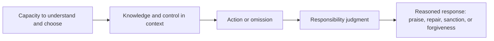

# Agency and responsibility

**Moral agency** is the capacity to understand reasons and norms, deliberate,
choose, and guide conduct in ways for which praise or blame can be appropriate.
**Moral responsibility** is a judgment that an agent is answerable for an
action or consequence because the action arose from relevant capacities and
was exercised under the right conditions. Responsibility is not identical to
causal authorship: causing an event does not by itself show that an agent was
free, informed, competent, or blameworthy.[^sep-moral-responsibility]

The analysis presupposes [entities, activities, and agents](../foundations/entities-activities-and-agents.md),
[causation and dependency](../foundations/causation-and-dependency.md),
[claims, evidence, and inference](../foundations/claims-evidence-and-inference.md),
and [roles, authority, and organizations](../foundations/roles-authority-and-organizations.md).

The ethical vocabulary of norms, reasons, agency, and control is introduced in
[norms, agency, and control](norms-agency-and-control.md).

# Conditions and degrees

Assess the relevant capacities, the agent's awareness of facts and norms, the
available alternatives, coercion or compulsion, dependency on others, and the
relationship between the agent's reasons and the action. These conditions often
come in degrees, so a careful judgment may distinguish full responsibility,
partial responsibility, excusing conditions, and cases where responsibility
is not appropriate. The standards differ between moral, legal, organizational,
and technical contexts; do not silently transfer one system's verdict into
another.

Responsibility can be prospective (a duty to act carefully), retrospective
(answerability for what happened), or shared across a group. Assigning a
role—such as system owner or operator—does not settle moral responsibility;
the assignment must be connected to actual control, knowledge, authority, and
reasonable opportunity to prevent or repair harm.

# Accountability in sociotechnical systems

Records of [information provenance and trust](../information-systems/information-provenance-and-trust.md)
can clarify who performed an activity and what information was available, but
an audit trail is evidence for a responsibility judgment, not the judgment
itself. Automated systems may distribute causal contribution across designers,
deployers, operators, and institutions; preserving human review and clear
decision rights helps prevent responsibility gaps.

An [assurance case](../assurance/assurance-case.md) can make the evidence,
assumptions, and decision criteria behind a system judgment reviewable, but it
does not replace the contextual judgment needed to assign moral responsibility.

[^sep-moral-responsibility]: Stanford Encyclopedia of Philosophy, [Moral Responsibility](https://plato.stanford.edu/entries/moral-responsibility/).
