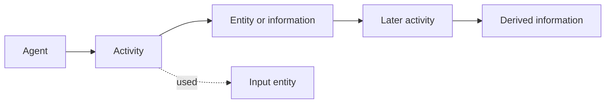

# Provenance as a trust input

Information provenance is a record of the people, institutions, entities, and
activities involved in producing, influencing, changing, or delivering a piece
of information. The W3C PROV-DM model treats provenance as a way to describe
those relationships so heterogeneous systems can exchange them and users can
make informed trust judgments.[^w3c-prov-dm]

Provenance is evidence about origin and process, not a trust score. Trust is a
contextual judgment that weighs provenance alongside source competence,
independence, integrity, recency, completeness, and the consequences of being
wrong.

The basic vocabulary is introduced in [entities, activities, and agents](../foundations/entities-activities-and-agents.md),
[information, data, and records](../foundations/information-data-and-records.md),
[time, identity, and relationships](../foundations/time-identity-and-relationships.md),
and [risk and decision](../foundations/risk-and-decision.md).

The operational traceability pattern is illustrated by [traceability events
and custody](../supply-chains/traceability-events-and-custody.md).

# A useful record

Capture the entities involved, the activities that generated or transformed
them, the responsible agents, timestamps, identifiers, and derivation or
attribution links. Record whether the statement is directly observed,
calculated, copied, summarized, or asserted by a source. Preserve version and
integrity information where it affects interpretation, and make gaps explicit
instead of silently treating missing lineage as evidence of absence.

This model applies across domains: [product provenance](../supply-chains/product-provenance.md)
tracks objects and supply-chain events, while [scientific claims](../science/evidence-and-scientific-claims.md)
track methods, data, and inference. In both cases, provenance improves review
but cannot substitute for evaluating the underlying evidence.

# Limits and operational use

A provenance graph can be incomplete, forged, inaccessible, or too complex for
a consumer to inspect. Authenticate contributors, authorize who may write or
read sensitive lineage, protect logs from undetected alteration, and retain
the context needed to interpret timestamps and identifiers. Consumers should
surface uncertainty and competing derivations, not collapse them into a single
unexplained trust label. Provenance is most useful when it supports a concrete
decision such as accepting, rejecting, reproducing, or investigating a claim.

An [assurance case](../assurance/assurance-case.md) uses provenance as part of
the evidence and argument for a bounded system claim; provenance alone does
not establish that the claim follows.

[^w3c-prov-dm]: W3C, [PROV-DM: The PROV Data Model](https://www.w3.org/TR/prov-dm/).
