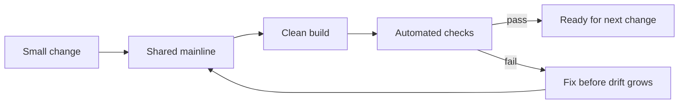

# Integrate early and often

Continuous integration (CI) is the practice of integrating each developer's
work into a shared mainline frequently—at least daily in Fowler's classic
definition—and verifying each integration with an automated build and tests.[^fowler-ci]
The purpose is rapid feedback: conflicts and integration errors are cheaper to
fix when the change set and suspected cause are small.

A useful CI pipeline checks out the exact revision, installs or resolves
declared dependencies, builds from a clean environment, runs relevant tests,
and publishes actionable results. Add linting, static analysis, security
checks, compatibility checks, or artifact validation when they address a
material risk. Keep the mainline releasable, make failures visible, and assign
ownership for restoring a broken build.

# Optimize for feedback, not ceremony

CI is not merely a server that runs tests after large batches of work. Small
changes, explicit build inputs, repeatable setup, fast checks, and a clean
failure signal are the enabling conditions. GitHub describes CI as frequent
commits combined with continuous build and test checks that detect errors
sooner and reduce merge-debugging effort.[^github-ci]

CI provides evidence for [code review](code-review.md) and [automated testing and test strategy](automated-testing-and-test-strategy.md), but passing CI is
not proof that untested requirements, production behavior, or operational
risks are safe.

[^fowler-ci]: Martin Fowler, [Continuous Integration](https://martinfowler.com/articles/continuousIntegration.html).
[^github-ci]: GitHub, [Continuous integration](https://docs.github.com/en/actions/get-started/continuous-integration).
