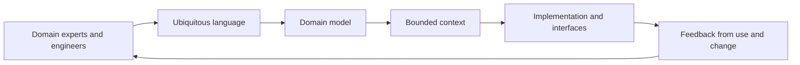

# Model the domain collaboratively

**Domain-driven design (DDD)** is a software design approach for managing
complexity by making the problem domain and its important rules explicit in a
[domain model](domain-model.md), then aligning the design and implementation with that model. Developers
and domain experts explore the model together and refine a [ubiquitous language](ubiquitous-language.md): terms whose meanings are shared in conversation,
documentation, tests, and code.[^domain-language-reference]

DDD is a way of making design decisions, not a framework or a requirement to
use microservices. Its value depends on a domain with meaningful behavior and
on sustained collaboration; applying its patterns mechanically can add
ceremony without improving understanding.

# Set boundaries before patterns

Strategic design looks at the whole problem space. A [subdomain](subdomain.md) is a
meaningful area of the business or problem space; a [bounded context](bounded-context.md) is a
part of a system within which a particular model and language are consistent.
The same word can legitimately mean different things in different bounded
contexts. A **context map** records how contexts relate, such as through a
shared kernel, published language, conformist integration, or an
anti-corruption layer that translates between models. These boundaries make
semantic disagreement visible instead of allowing one supposedly universal
model to accumulate incompatible meanings. A [context map](context-map.md) makes
those relationships explicit; its common relationships include a [shared kernel](shared-kernel.md),
[published language](published-language.md), [conformist integration](conformist-integration.md),
and [anti-corruption layer](anti-corruption-layer.md).

Strategic choices should follow real business capability, model differences,
team ownership, integration constraints, and expected change. A bounded
context can be implemented as a module, application, or service; the modeling
boundary and the deployment boundary are related decisions, not synonyms.

# Make rules executable inside the model

Tactical design gives domain rules precise homes:

- [Entities](entities.md) have identity that persists across changes, while [value objects](value-objects.md) are defined by their attributes and are usually immutable.
- An [aggregate](aggregate.md) is a consistency boundary with an [aggregate root](aggregate-root.md) through
  which outside code coordinates changes. Its invariants should be enforced at
  that boundary, keeping transactions and concurrency decisions explicit.
- [Domain services](domain-services.md) express meaningful domain operations that do not fit one
  entity or value object. [Domain events](domain-events.md) record important occurrences so
  other parts of the model can react without hiding the causal change.
- [Repositories](repositories.md) provide a domain-oriented way to retrieve and persist
  aggregates; they should not turn the domain model into a thin wrapper around
  a particular database.

These patterns are options for preserving model integrity, not a mandatory
checklist. Keep technical concerns at explicit boundaries and let the model
expose the behavior and invariants that matter to the domain.

DDD connects [requirements engineering and acceptance](requirements-engineering-and-acceptance.md)
to a model that can express domain behavior, and it gives
[architecture documentation and decisions](architecture-documentation-and-decisions.md)
meaningful boundaries and trade-offs to record. Its emphasis on shared
meaning builds on [semantics and models](../foundations/semantics-and-models.md)
and [systems, processes, and boundaries](../foundations/systems-processes-and-boundaries.md).
The resulting domain contracts can shape [API and interface design](api-and-interface-design.md),
while [maintainable code and refactoring](maintainable-code-and-refactoring.md)
helps evolve the model without losing its intended behavior.

[^domain-language-reference]: Eric Evans, [Domain-Driven Design Reference: Definitions and Pattern Summaries](https://www.domainlanguage.com/wp-content/uploads/2016/05/DDD_Reference_2015-03.pdf).
