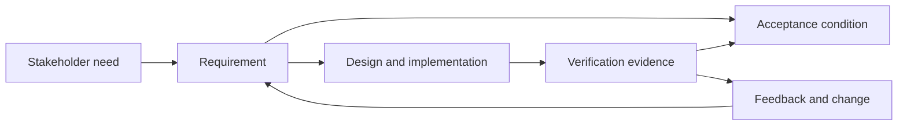

# Start with the problem and intended use

Requirements engineering is the disciplined process of discovering,
analyzing, specifying, validating, communicating, and managing the needs and
constraints a software system must satisfy. ISO/IEC/IEEE 29148:2018 treats it
as a lifecycle activity rather than a one-time document-writing phase.[^iso-29148]
Begin with stakeholders, users, intended use, operating context, and desired
outcomes; then make assumptions, constraints, non-functional qualities, and
trade-offs visible.

A useful requirement is specific enough to be understood consistently,
feasible within its constraints, testable, and traceable to a need. Avoid
confusing a proposed implementation with the need it serves. Record
uncertainty instead of disguising guesses as commitments.

# Connect requirements to evidence

For each important requirement, define observable acceptance conditions before
implementation. The conditions may be examples, tests, measurements, or an
explicit review decision. Trace the relationship from stakeholder need to
requirement, design choice, implementation, and verification evidence. This
trace makes change impact and omissions easier to detect, and it connects
software work to [claims, evidence, and inference](../foundations/claims-evidence-and-inference.md)
and [requirements, risk, and review](../assurance/requirements-risk-and-review.md).

Requirements are hypotheses about value and behavior, not proof that a system
will work. Revisit them when evidence, users, constraints, or risks change.

[^iso-29148]: ISO, [ISO/IEC/IEEE 29148:2018](https://www.iso.org/standard/72089.html).
