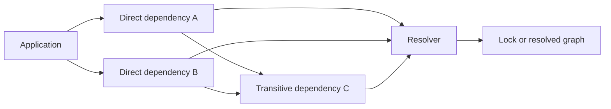

# Dependency graphs

A software dependency is a component a project requires to build, run, test,
or operate. Dependencies form a directed graph: a project depends on package
 A, which may depend on B. A declaration should identify the component, the
allowed versions, relevant environment markers or platform constraints, and
whether the dependency is needed at runtime, build time, or only for
development.

# Compatibility and resolution

Compatibility means that a component can satisfy the assumptions its consumer
makes about interfaces, behavior, data formats, resources, and environment.
Version numbers are communication, not proof. Semantic Versioning 2.0.0
defines a public API contract in which compatible bug fixes increment the patch
version, backward-compatible additions increment minor, and incompatible API
changes increment major.[^semver] A project should still test the concrete
combination it ships because implementations may violate their versioning
promise and compatibility can depend on configuration or platform.

Dependency specifiers express a set of acceptable versions rather than one
universal answer. Python's packaging specification allows exact, ranged, and
environment-marked requirements, leaving tools to resolve a set that satisfies
all constraints.[^python-dependency-specifiers] A resolver may fail when the
constraints are inconsistent, choose different valid versions at different
times, or need a lock file to make one tested resolution repeatable.

# Safe maintenance

Declare only the interface and version range actually supported; constrain
more tightly when an incompatibility or security requirement warrants it.
Review transitive dependencies, provenance, licenses, and known vulnerabilities;
update deliberately; test builds and runtime behavior; and record the resolved
artifact hashes where reproducibility matters. Distinguish source-level API
compatibility from binary, behavioral, data, and operational compatibility.

Dependency metadata and lock files are provenance evidence for [information provenance and trust](../information-systems/information-provenance-and-trust.md),
but they do not prove that a package is safe or that its publisher's claims are
true. Verify artifacts and exercise the resulting system in the target
environment.

For a system-level [assurance case](../assurance/assurance-case.md), the
resolved dependency graph, artifact hashes, tests, and target-environment
results can support claims about the specific software release rather than a
generic claim about a package.

[^semver]: [Semantic Versioning 2.0.0](https://semver.org/spec/v2.0.0.html).
[^python-dependency-specifiers]: Python Packaging Authority, [Dependency specifiers](https://packaging.python.org/en/latest/specifications/dependency-specifiers/).
