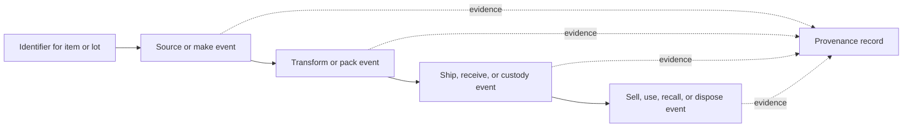

# Meaning and scope

Product provenance is the evidence-backed account of a product's origin,
identity, composition, handling, location, ownership or custody, and changes
through production, processing, distribution, and use. **Traceability** is the
ability to follow that history, application, movement, and location through
specified stages; provenance is the resulting account plus the evidence that
supports it.[^iso-22005]

Its basic vocabulary comes from [entities, activities, and agents](../foundations/entities-activities-and-agents.md),
[time, identity, and relationships](../foundations/time-identity-and-relationships.md),
[information, data, and records](../foundations/information-data-and-records.md),
and [security properties and integrity](../foundations/security-properties-and-integrity.md).

The event and custody mechanism is developed in [traceability events and
custody](traceability-events-and-custody.md).

Provenance is not the same as a marketing story or a single “made in” field.
It is a chain of claims whose usefulness depends on stable identifiers,
complete enough event coverage, trustworthy clocks and locations, and controls
that prevent or reveal unauthorized alteration.

# Event-based model

GS1 EPCIS models visibility as event data about identified physical or digital
objects, describing what happened, where and when it happened, and why. It is
designed to share those events across organizational boundaries and to capture
status, location, movement, and chain of custody.[^gs1-epcis]

An event record should make explicit, as applicable:

- **What:** a globally meaningful product, instance, lot, container, or
  digital representation.
- **When and where:** event time or interval and the relevant facility,
  location, or jurisdiction.
- **Why:** business step, transaction, disposition, or process context.
- **Who:** the party responsible for recording or asserting the event, with [digital identity and authorization](../cybersecurity/digital-identity-and-authorization.md) controls around submission and access.
- **Inputs and outputs:** materials consumed, products created, aggregation,
  disaggregation, or transformation relationships.

# Trust, gaps, and use

Evidence can include process records, scans, sensor observations, shipping
documents, laboratory results, certificates, and signed attestations. A
provenance claim should preserve its source, timestamp, scope, and uncertainty
instead of implying that an unobserved interval did not contain an event.
Organizations should define which events are mandatory, retain enough linkage
to trace both backward to sources and forward to recipients, and test records
for duplicate identifiers, impossible sequences, missing handoffs, and
inconsistent quantities.

Traceability systems support targeted recalls, counterfeit detection, quality
investigation, regulatory reporting, sustainability claims, and operational
visibility. They do not automatically prove ethical sourcing, product safety,
or authenticity: those conclusions require suitable evidence, independent
checks, and a stated decision rule. Different parties may also have legitimate
reasons to redact commercial or personal information, so “complete” means
complete for the declared purpose and access scope.[^iso-22005]

When a provenance record supports a safety, authenticity, or compliance
decision, an [assurance case](../assurance/assurance-case.md) can connect the
event evidence to the decision claim and make gaps, assumptions, and review
criteria explicit.

[^gs1-epcis]: GS1, [EPCIS 2.0.1 Standard](https://ref.gs1.org/standards/epcis/2.0.1/).
[^iso-22005]: ISO, [ISO 22005:2007 Traceability in the feed and food chain](https://www.iso.org/standard/36297.html).
